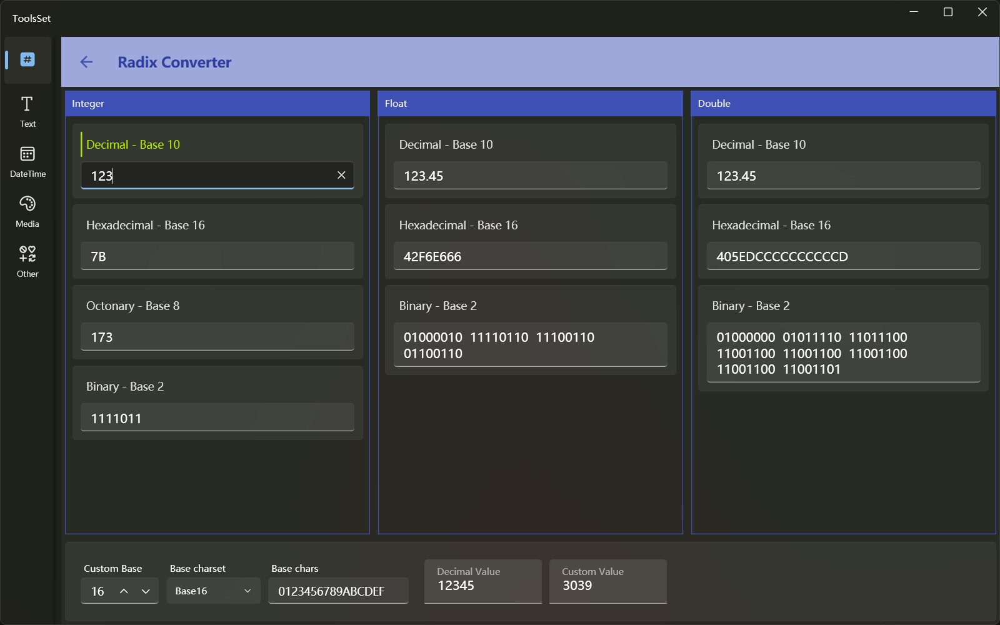

## Introduce

This tool supports
* Convert Dec, Hex, Oct and Bin to each other
* Float and double to Hex and Bin
* Hex to flaot or double
* Arbitrary conversion of decimal integer
* Decimal integers are converted into strings of the specified character set

> If the conversion data format is entered incorrectly, the contents of the other corresponding result text boxes will be cleared

## How to use

### Integer conversion
The first area at the top is the integer conversion area, and there are four text boxes used to input:
* Dec
* Hex (up to 16 Hex characters, case-insensitive)
* Oct
* Bin (up to 64-bit 0 or 1)

Enter a string that conforms to the format in each text box, and the other three text boxes can display the corresponding conversion results of other formats

> The data range is a signed 64-bit integer range, i.e. -9,223,372,036,854,775,808 to 9,223,372,036,854,775,807, and the hexadecimal is: 80000000000000000000 ~ 7FFFFFFFFFFFFFF 

### Float conversion
The second area at the top is the float conversion area, and there are three text boxes used to input:
* Dec (range is -3.4028235E38 ~ 3.4028235E38)
* Hex (up to 8 Hex characters, case-insensitive)
* Bin

Dec and Hex can be entered, and binary is read-only

### Double conversion
The third area at the top is the double conversion area, and there are three text boxes used to input:
* Dec (range is -1.7976931348623158E308 ~ 1.7976931348623158E308)
* Hex (up to 16 Hex characters, case-insensitive)
* Bin

Dec and Hex can be entered, and binary is read-only

> Float and double convert inputs support scientific notation, you need to pay attention to the input method, you can use two ways to input
> 1. Enter the exponent first, followed by significant figures. For example, if you enter 1.2e3, enter e3 first, and then enter 1.2 before e
> 2. Enter all the numbers first, then enter the e. For example, if you enter 1.2e3, enter 1.23 first, and then enter e before 3
> * The letter e is not case-sensitive

### Arbitrary radix conversion

At the bottom of the interface, you can convert integers to any base, the controls are:
* Custom base: Enter the base you want to convert
* Base charset: Several predefined character sets are available to choose from
* Base chars: You can edit the characters used in the conversion result
* Decimal value: The number before conversion, the conversion result can be obtained when entered
* Custom value: The result of conversion, you can enter the reverse conversion to get the number before the conversion

The predefined character set includes Base16, Base64, base 27 (lowercase/uppercase letters), base 10 Chinese, Base2 and other methods

When you select a predefined character set, the Custom base is automatically modified based on the selected character

Conversion examples:

| | |
|-|-|
| Decimal value | 123 |
| Base16 | 7B |
| Base64 | 1X |
| Lowercase| do|
|Uppercase|DO|
|Chinese1|一二三|
|Chinese2|壹贰叁|
|Base2_1|▮▮▮▮▯▮▮|
|Base2_2|││││─││|
|Base2_3|➊➊➊➊⓪➊➊|
|Base2_4|⌃⌃⌃⌃⌄⌃⌃|
| | |

Conversions can be done using other base and custom characters
For example, 123 is represented as 323 in the Hex value of the number, and >>< is expressed in the base 5 of the character set []-<><
 
> If the conversion base is greater than the number of characters provided, the values not included in the character set will be expressed as [N], e.g. 123 with only ab in the base 3 will result in bbb[2]a
>
> Don't use duplicate characters in character sets
>
> The characters used in reverse conversion must be included in the set of characters and are case-sensitive