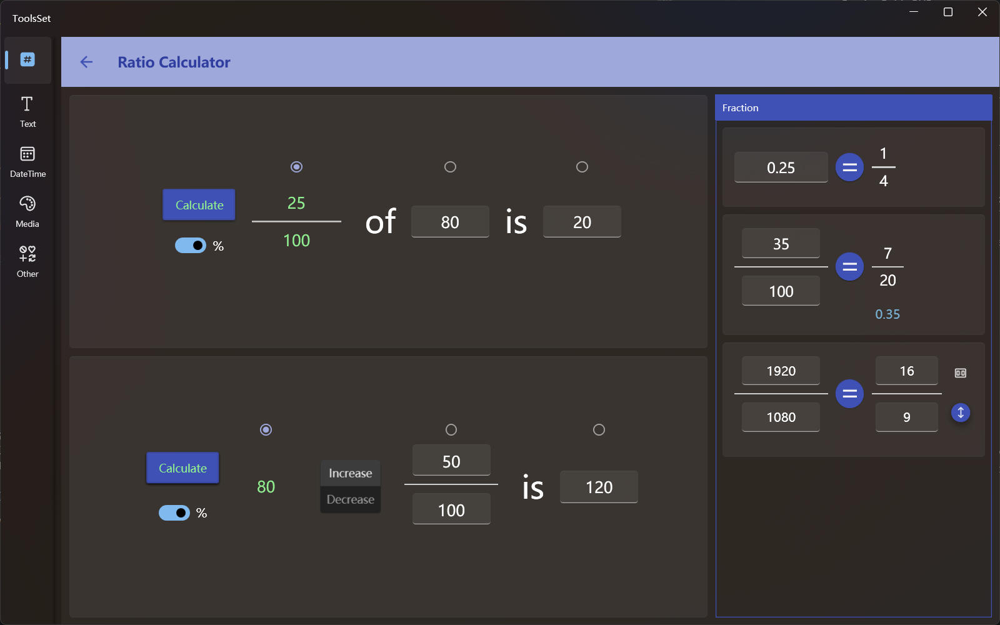

## Introduce

This tool can perform various ratio calculations, percentage calculations, calculate growth rates, fractional simplification, decimal to fractions, proportional operations, etc

## How to use

* Ratio calculation
  
  At the left top is the Ratio Calculation tool, where two of the known values can be used to calculate a third value
   
  > You can turn on the left % switch to fix the denominator of the fraction to 100
  >
  > If the % switch is not turned on when calculating the scale, the result will be automatically simplified to obtain the lowest fraction

* Growth rate calculation
  
At the left bottom is the growth rate calculation tool, the operation method is similar to the Ratio calculation, and the two buttons in the middle can choose whether to increase or decrease

* Decimal to fraction
  
At the right top is the decimal to fraction tool, enter a number in the text box, and click the [=] button to get the lowest fraction of this number

* Fraction simplification

At the right middle is the fraction simplification tool. Enter the fraction to be simplified on the left, click the [=] button to get the lowest fraction of this number, and the decimal corresponding to this fraction will be displayed on the bottom

* Proportional equal calculation
   
At the right bottom is the proportional operation equal tool, and on the left and right of [=] are two fractions with equal values, and you can enter three of them to calculate the last value

There are two buttons on the right, the upper one can be used to select the common scale, and the lower button can be clicked to swap the numerator and denominator of the fraction on the right 

>! Decimals can be entered in all input fields for this tool
>
> All calculations are up to 4 decimal places