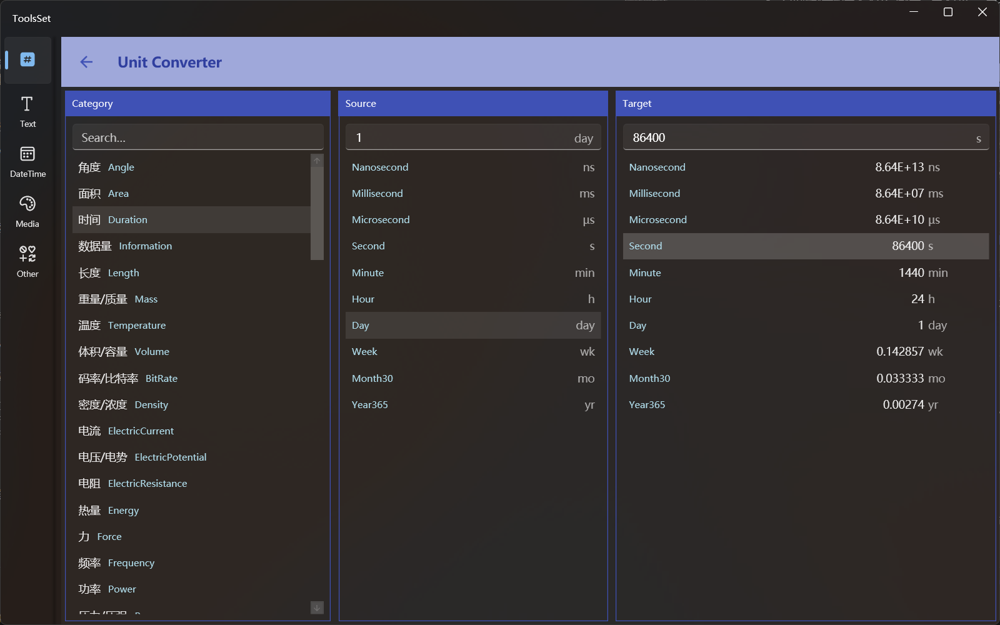

## Introduce

This tool supports dozens of mathematical, physical and chemical unit conversions, including commonly used: angle, area, time, length, weight/mass, temperature, volume, data volume, etc

## How to use

1. Select Unit Type: Select the unit type you want to convert from the list on the left
   > You can enter the type name in the text box above the list to quickly find it, and you can support fuzzy matching between Chinese and English name
2. Select Units to be Converted: Select the source units you want to convert from the middle list
3. Enter the quantity: Enter the value in the text box in the middle
4. View Target Quantity: The list on the right will display all the unit quantities converted by the specified quantity unit, and you can select any of them to view

> After selecting a target unit, the corresponding value will be displayed in the text box at the top, and the text can be selected and copied