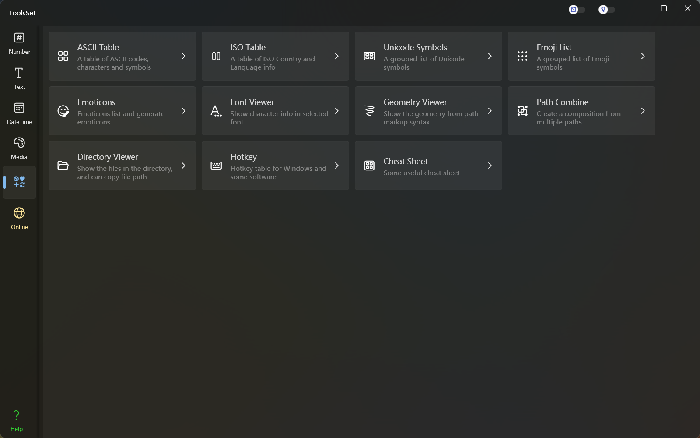

## Introduce

Features include: ASCII Table, ISO Table, Unicode Symbols, Emoji List, Emoticons, Font Viewer, Geometry Viewer, Path Combine, Directory Viewer, Hotkey, Cheat Sheet

## Features List

### ASCII Table 
* View ASCII control characters
* View ASCII printable characters
* View ASCII extended characters
* Contains Hex, Oct, Dec codes and symbol, HTML code

### ISO Table 
* View the ISO country
  * English name and Chinese name of country, domain name
  * GECCode, two-digit code, three-digit code, ISO No.
  * Currency name, currency code
* View the ISO language
  * English name and Chinese name of language
  * ISO code, name of local language

### Unicode Symbols 
* View Unicode characters by category
* Search Unicode categories by name or code
* Displays characters in the specified font
* Frequently used characters are viewed by category

### Emoji List 
* View Emoji by category
* Search Emoji by name
* Copy Emoji characters and images
* The whole emoji or it's components are converted to geometry codes

### Emoticons 
* View Emoticons by category
* Generate Emoticons by specific parts
  * Specify the part character
  * Use random characters
* Edit Emoticons

### Font Viewer 
* Set the font family and typeface
* Pagination jumps
* View content includes: characters, Dec code, Hex code, XML/CSS/JS usage, Geometry string

### Font File Viewer 
* Select font file and typeface
* Pagination jumps
* View content includes: characters, Dec code, Hex code, Geometry string

### Geometry Viewer 
* String conversion to path viewing
* Fill switch
* Set the border and fill color
* SVG and PNG file can be saved
* Path scale, rotate, filp

### Path Combine
* Add and remove path code
* Geometry code to path
* Path rotation, translation, scale transformation
* Set the border and fill color
* Copy the combined geometry code and SVG code
* SVG and PNG file can be saved

### Directory Viewer 
* View the local file directory
* Copy the folder path
* Copy the file name
* Go to the specified path

### Hotkey 
* Include hotkeys of Windows, Excel, Word, Visual Studio, Visual Studio Code, IntelliJ IDEA，JetBrains Rider, Photoshop, Illustrator, AutoCAD

### Cheat Sheet 
* Include Python Func, Vim Command, Linux Command, Http Status, CAD Command, Regex, Morse Code, XPath, Windows CMD

