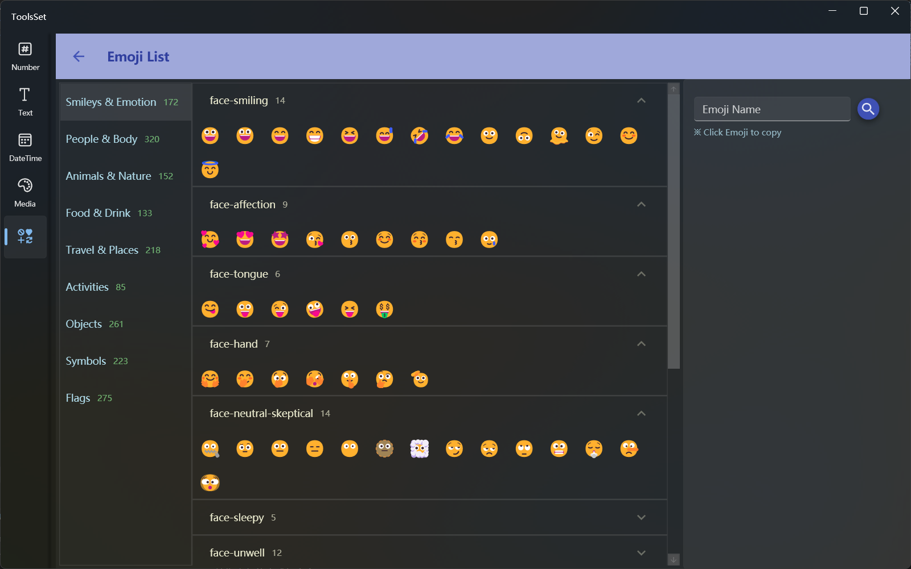

## Introduce

It contains more than 1800 emojis, can viewed by category, searched by name, and copy emoji

## How to use

On the left is categories list, and subcategories are displayed in the middle after selecting a category

You can click on the title row to switch the expansion status of a subcategory, and you can view all Emojis included in it after expansion

Hover over the emoji to view the name and icon, and click the emoji to copy it to the clipboard

You can enter the name in the text box on the right and click the button to search, the search results will be displayed below, you can click Emoji to copy
