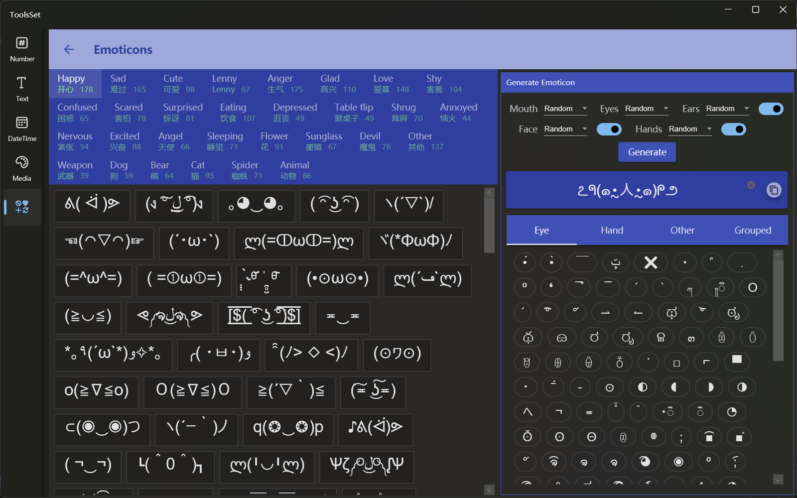

## Introduce

Contains more than 2,000 predefined emotion text in 30 categories, and you can select parts to generate and edit emotion text

## How to use

* View list of emotions

Click on the category headings at the top left to view emotion text in each category, and click to copy it

* Generate emotions
  You can select the parts on the upper right side, which includes: mouth, eyes, ears, face, and hands, the mouth and eyes must be selected, and then click the generate button to automatically generate

  > All parts can be selected randomly by selecting Random
  >
  > Whether the ear, face, and hand parts are generated can be specified by the switch on the right
  >
  > The auto-generated text is displayed in the text box below, you can click the copy button on the right to copy it

* Edit emotion
  
Enter characters to edit in the text box, and at the bottom right is a list of predefined parts, which can be added to the text box by clicking it

  > You can copy the predefined text on the left to the text box and modify them
  >
  > You can auto generate a text and then modified based on that
  >
  > You can create a new text and then add parts to it