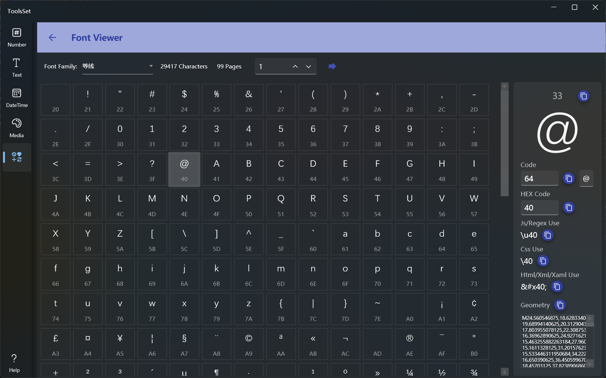

## Introduce

View information about the characters contained in a specified system font and convert character to geometry

## How to use

* Select font: Select a system-installed font in the drop-down box above, and the count of characters and pages displayed in the font will be displayed on the right side, with a maximum of 200 characters per page, and you can jump to a specified page on the right
* Jump page: You can enter the number of pages in the text box and click the arrow icon to jump, or you can click the up and down arrows to view the page by page
* View characters: Click a character in the list below to view the character information on the right side, including the decimal encoding, hexadecimal encoding, Js/Regex usage, CSS usage, HTML/XML usage, and the geometry of the character
  > You can view the character by entering the character code in the text box, or you can enter the character in the text box to the right of the decimal code to view their information
  >
  > You can use the copy button on the right of the character information to copy its code and other corresponding content
