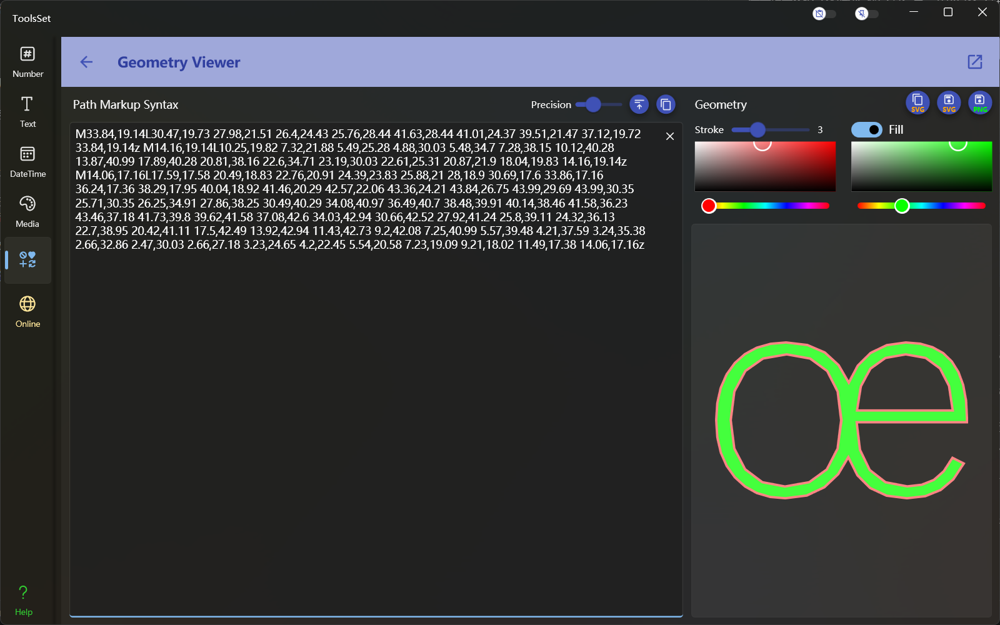

## Introduce

Convert the geometry code into path, simplify the path, specify the border and fill settings, and support copy SVG string or save to SVG and PNG file

## How to use

* Edit Path: Enter the geometric code in the left text box, if the code is incorrect, an error message will be displayed below
* Simplify the path: you can set the accuracy of the path coordinates at the top right end of the left side, click the button on the right to update the content in the text box after set the precision, and the button on the far right can quickly copy the text
* Path settings: You can modify the settings at the top of the right side, including the width and color of the border, whether it is filled, and the fill color can be set after the fill is enabled
* Save Result: The three buttons on the upper right side can be used to: copy SVG string, save SVG file, and save PNG file
