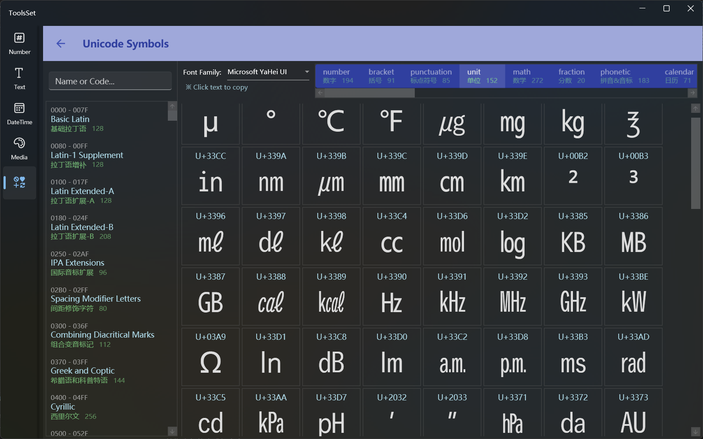

## Introduce

You can view Unicode characters by category and support font selection

## How to use

On the left is a category list of all Unicode characters, including characters with encoding range of 0000~1FAFF

When you select a category, all the characters in the category will be displayed on the right, and the information will be displayed with code and character, it can be copied to the clipboard by clicking on the characters

> You can search categories on the top of the list by English name, Chinese name and character code
>
> The font drop-down box at the top right can be used to select a font, and some special characters can only be displayed in a specific font
>
> The horizontal list in the upper right corner lists more than 30 commonly used character category, including number, punctuation, unit, mathematical symbol, various shapes, etc., which can be viewed after selecting the category, and can be copied by clicking on the character