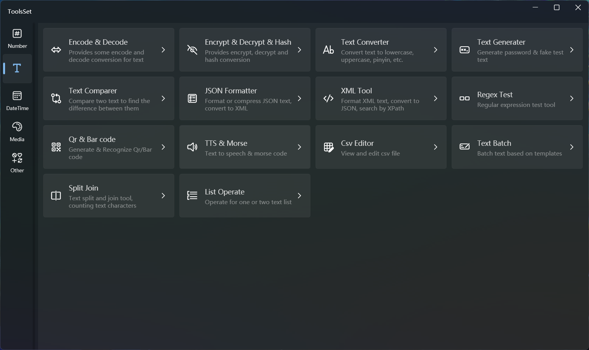

## Introduce

Features include: Encode & Decode, Encrypt & Decrypt & Hash, Text Converter, Text Generator, Text Compare, JSON Formatter, XML Tool, Regex Test, Qr & Bar code, TTS & Morse, Csv Editor, Text Batch, Split Join, List Operate

## Features List

### Encode & Decode 
* Common encoding conversion (11 types)
  * Byte array
  * ASCII
  * UTF-8
  * Iso 8859-1
  * UTF-16
  * UTF-16 BE
  * UTF-32
  * UTF-32 BE
  * GB2312
  * BIG5
  * Shift-JIS
* Base encoding conversion (11 types)
  * Base64
  * Base32（6 types）
  * Base58（3 types）
  * Base85（3 types）

### Encrypt & Decrypt & Hash 
* Encrypt and decrypt
  * AES encrypt and decrypt
  * DES encrypt and decrypt
  * RSA encrypt and decrypt
* Hash
  * MD5-16
  * MD5-32
  * SHA1
  * SHA256
  * SHA384
  * SHA512

### Text Converter 
* Alphabet conversion
  * Uppercase
  * Lowercase
  * Snake
  * Pascal
  * Camel
  * Kebab
  * Constant
  * Header
  * Case reverse
* Chinese conversion
  * To simplified
  * To traditional
  * To pinyin without tone
  * To pinyin with tone
  * To Pinyin title
  * To name pinyin
  * To pinyin initials
  * Pinyin to Chinese characters
  * Pinyin to Chinese name
* Japanese conversion
  * Hiragana / katakana -> romaji
  * Romaji / katakana -> hiragana
  * Romaji / hiragana -> katakana
  * Half-width character -> full-width character
  * full-width -> half-width characters
  
### Text Generator 
* Password generate
  * Specify the length
  * Contains numbers
  * Contains uppercase and lowercase letters
  * Contains special symbols
  * Contains custom characters
* Fake text generate
  * 12 languages (some types supported)
  * 34 data types
  * Specify the quantity
  * Specify the range

### Text Compare 
* Highlight the text comparison results

### JSON Formatter 
* JSON format
* JSON compress
* JSON flatten
* JSON unflatten
* JSON to XML

### XML Tool 
* XML format
* XML compress
* XML to JSON
* XPath lookup

### Regex Test 
* 82 predefined regular expressions
* Regular expression test
  * Global, multi-line, case-sensitive switch
  * Show result group
  * Show captures

### Qr & Bar code 
* Generate barcodes or QR codes (13 types)
* Recognize barcodes or QR codes

### TTS & Morse 
* TTS
  * Direct play
  * Export audio
* Morse code conversion
  * Text-to-Morse encoding
    * Direct play
    * Export audio
  * Morse code to text

### Csv Editor 
* Edit the CSV with grid
  * Support add and delet rows and columns
  * Support view text

### Table Convert
* Tabular data editing
  * Support add and delete rows and columns
  * Support row and column transpose
  * Support for converting selection areas
* Data conversion
  * CSV
  * JSON
  * XML
  * Markdown
  * HTML
  * ASCII
  * SQL
  * YAML
  * C# Object

### Text Batch
* Grid form batch text
  * Formulas are supported
  * Support templates

### Split Join 
* Text split
  * Split by quantity
  * Split by character
  * Specify separator
* Text merge
  * Merge multiple spaces
  * Merge multiple line breaks
  * Merge multiple whitespace characters
  * Merge multiple specified characters
* Multi-line text join
  * Join with a space
  * Join with tabs
  * Join with the specified characters
* Text trim
  * Specify the location
  * Specify trim characters
* Word count
  * Count characters by type
  * Count ASCII characters
  * Count top 100 characters
  * Count specified text

### List Operate 
* Sort
  * Ascending, descending
  * Random sorting
  * Ascending by length, descending by length
  * Reverse order
  * Number format switch
* Find
  * Start with or not
  * End with or not
  * Contain or not
  * Length matching
* Pad 
  * Specify the location: left, right
  * Specify characters
  * Specify the length
* Take
  * Specify direction: start, end
  * Skip and take by quantity
  * Skip and take by character
* Single operate
  * Distinct list items
  * Count list items
  * Reverse order of character
* List operate
  * Union with another list
  * Intersect with another list
  * Except with another list
  