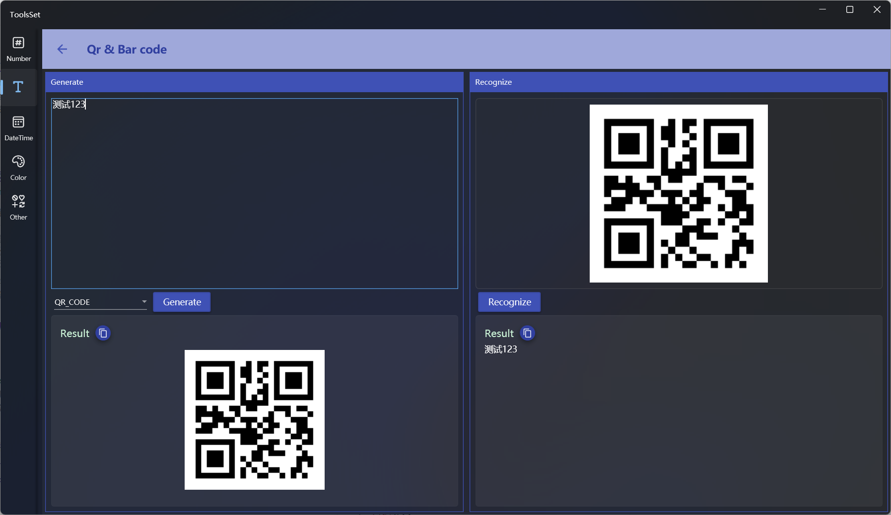

## Introduce

Provides various types of barcode and QR code generate and recognize

## How to use

The left side is the barcode and QR code generate area, and the right side is the barcode and QR code recognize area

### Generate barcode and QR code

1. Enter the text to encode in the text box above
2. Select the encode type from the 13 types provided in the drop-down box
3. Click the [Generate] button to generate the image below, and you can click the copy icon to copy the image

### Recognize barcode and QR code

1. Right click on the upper area and select Open Image File or Paste in th context menu
2. Click the [Recognize] button, the recognized text will be displayed below, and you can click the copy icon to copy the text