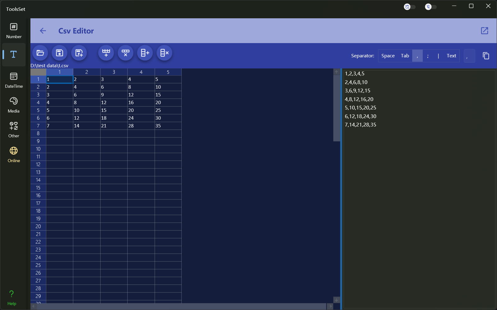

## Introduce

Edit the Csv file in the form of a grid, and at the same time you can view the text content, and support row and column operations

## How to use

The left side is the grid editing area, and the right side is the text viewing area

* The buttons in the top toolbar are used to: Open File, Save File, Save File as, Add Rows, Delete Rows, Add Columns, and Delete Columns
* After the file is opened, the content of the file will be displayed on the left and right side at the same time, and the content will be synchronized to the right side after edit on the left side and click Save
* The grid supports dragging and copying contents in the rows and columns of cells, and multiple cells will be filled in the sequence if there is a sequence relationship
* The row insert position is below the first cell in the selection area, and the column insert position is to the right of the first cell in the selection area
* In a cell you can use [Ctrl+Enter] to enter line break, and you can use the arrow keys to navigate in the grid
* You can select a separator in the list at the top of the right, and the text box on the right is available after selecting [Text], and you can enter a custom separator
* Click the copy button at the top right to quickly copy the result text