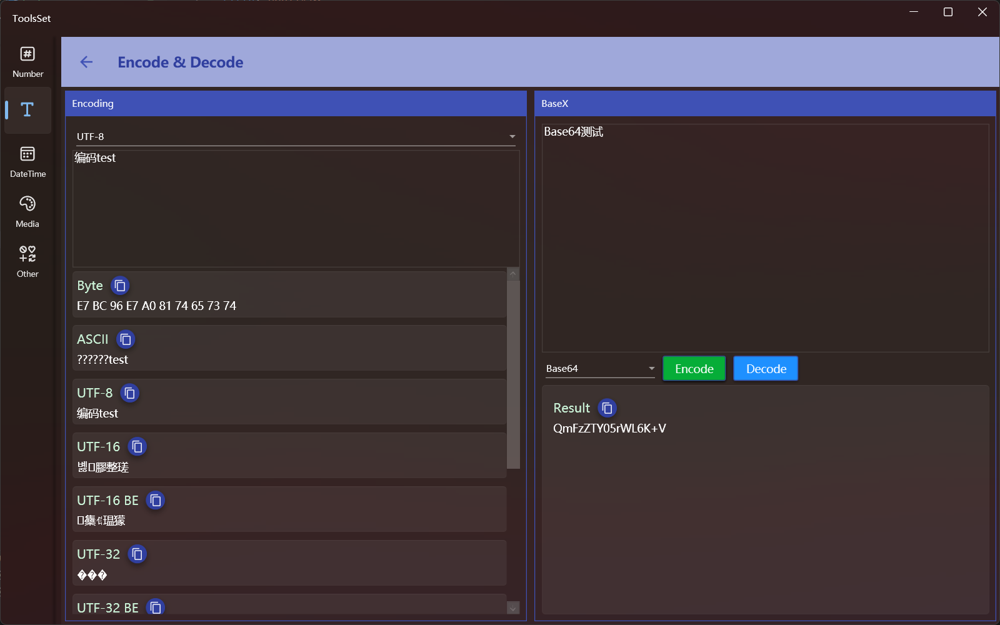

## Introduce

It provides 11 types of common charset encoding and 13 types of Base encode and decode

## How to use

The left side is the charset encoding conversion area, and the right side is the Base encode and decode area

### Charset encoding conversion

1. Select an encoding type: Select a source encoding method from the drop-down list
2. After entering the text to be converted, the text will be automatically encoded and displayed in the area below, you can click the copy button on the right to copy the text

### Base encode and decode

1. Enter the text you want to encode or decode in the text box on the right
2. Select an encode or decode type from the drop-down list
3. Click the [Encode] button on the right to encode, and click the [Decode] button to decode
4. The result will be displayed below, and you can click the copy button to copy the text