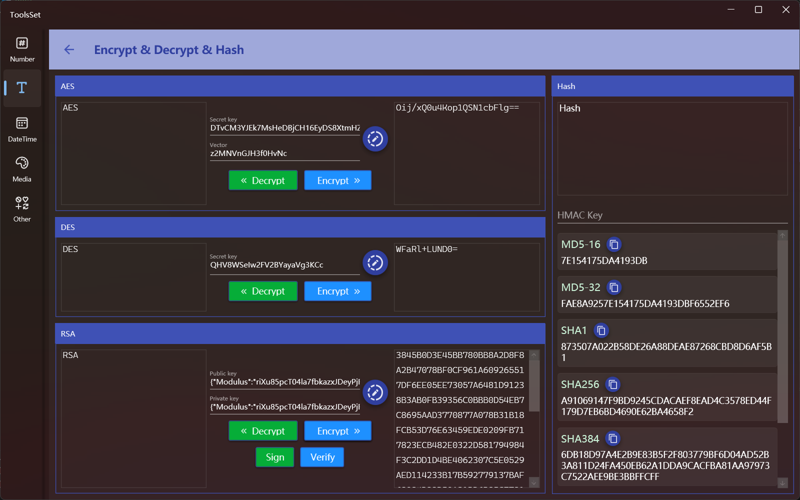

## Introduce

Encryption and decryption tools, providing AES, DES, RSA encryption and decryption as well as various methods of Hash encoding.

## How to use

The left side is the encryption and decryption area, the right side is the Hash encoding area.

### Encrypt & Decrypt

Click the 【Generate Key】 button on the right to automatically generate a random key.
1. AES
  
   > The key is a 32-character string; the vector is a 16-character string and can be empty.

   * Encrypt

     Enter the text on the left side and click the [Encrypt] button to generate the encrypted result on the right side.

   * Decrypt

     Enter the ciphertext on the right side and click the [Decrypt] button to generate the plaintext on the left side.
  
2. DES
    > The key is a 24-character string.

    * Encrypt

      Enter the text on the left side and click the [Encrypt] button to generate the encrypted result on the right side.

    * Decrypt

      Enter the ciphertext on the right side and click the [Decrypt] button to generate the plaintext on the left side.

3. RSA
   * Encrypt

     Enter the text on the left side and click the [Encrypt] button to generate the encrypted result on the right side.

   * Decrypt

     Enter the ciphertext on the right side and click the [Decrypt] button to generate the plaintext on the left side.

   * Sign

     Enter the plaintext on the left side and click the [Sign] button to generate the signature on the right side.

   * Verify

     Enter the string to be verified on the right, click the 【Verify】 button to validate the string, and the verification result will pop up in a dialog box.

### Hash

Enter the text to be encoded in the upper text box, and the corresponding Hash code value will be automatically calculated below.

You can enter a string in the HMAC Key text box to generate a Hash code with key authentication.