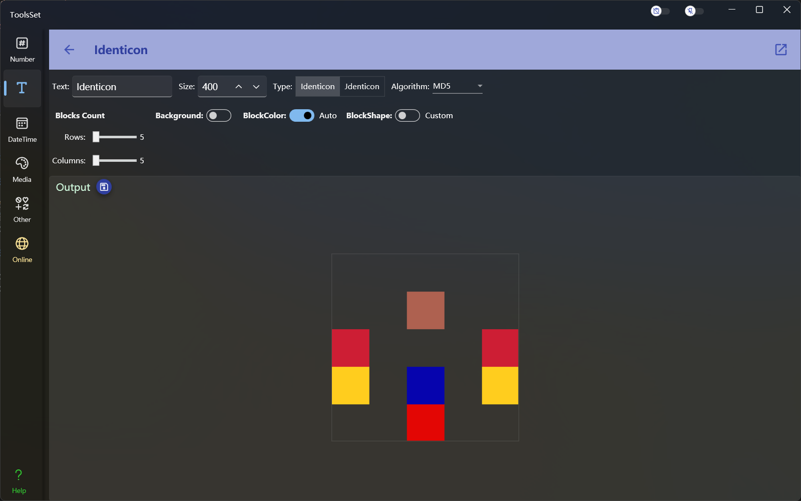
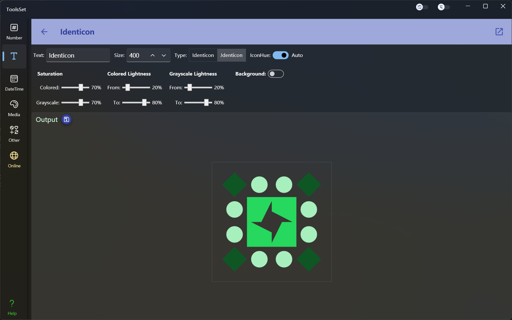

## Introduce

Generate Identicon or Jdenticon avatar based on the specified text.

## How to use

The upper toolbar allows you to input the text, output size, and select the avatar type. The hash avatar will be automatically generated after the text is modified.

### Identicon Settings

The type Identicon can set its related parameters, including:

* Algorithm: Used to specify the hash algorithm used during conversion, options include: MD5, SHA1, SHA256, SHA384, SHA512
* Blocks Count: Used to set the number of row and column blocks included in the generated avatar, ranging from 5 to 20
* Background: Used to set the background color of the generated avatar; when the switch is off, the background is transparent, and when the switch is on, a specific background color can be set.
* Block Color: Used to set the color of the blocks in the generated avatar. When the switch is on, the color will be automatically selected; when the switch is off, you can specify block colors. 
* Block Shape: Used to specify the shape of the blocks in the generated avatar. When the switch is off, the shape will be automatically selected; when the switch is on, you can specify the shapes and proportions to include. The shapes that can be specified include: rectangle, triangle, diamond, pie. After checking the checkbox before the shape, you can specify the proportion of the shape, with a range from 0 to 100. The larger the value, the more blocks with this shape will be included.

### Jdenticon Settings

The type Jdenticon can set its related parameters, including:

* IconHue: Used to set the hue of the generated avatar; when the switch is turned on, the hue will be automatically selected; otherwise, a specific hue for the avatar can be used.
* Saturation: Used to set the saturation of the generated avatar; saturation for both colored and grayscale can be specified.
* Colored Lightness: Used to set the lightness range of the colored part; two sliders specify the minimum and maximum values of the range.
* Grayscale Lightness: Used to set the lightness range of the grayscale part; two sliders specify the minimum and maximum values of the range.
* Background: Used to set the background color of the generated avatar; when the switch is off, the background is transparent, and when the switch is on, a background color can be specified.
