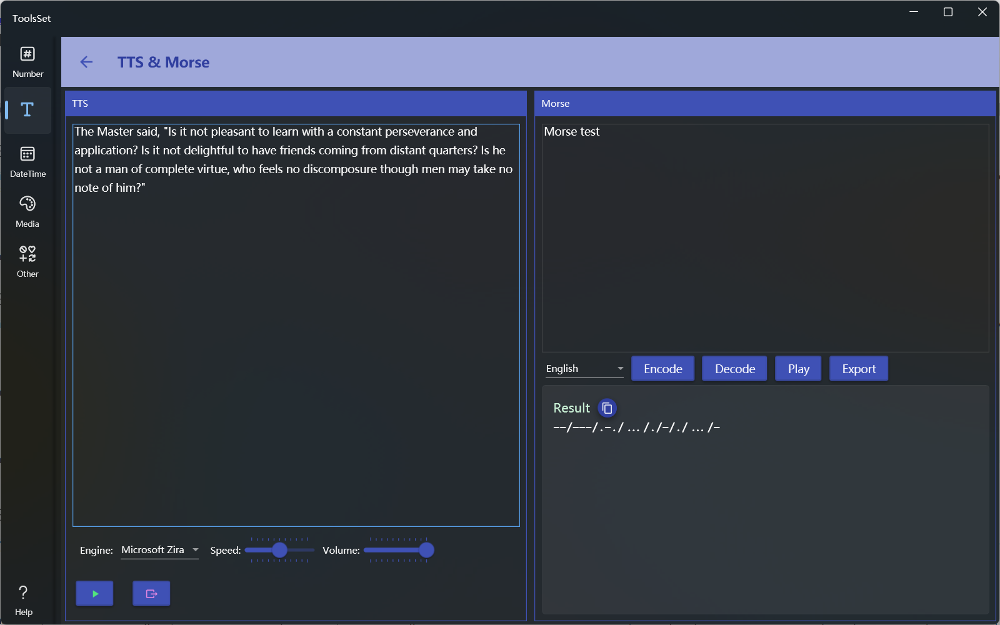

## Introduce

Use the system-installed speech engine to convert text to speech, provides text and Morse code conversion, and support audio playback and audio file export

## How to use

The left side is the text-to-speech area, and the right side is the Morse codec area

### TTS

* Enter the text to be converted in the upper text box, select the language engine you want to use from the drop-down box, you can use the slider on the right to adjust the speech speed and volume, and the lower two buttons are used to play and export the voice audio

### Morse codec

* Enter the text to be converted in the text box above, select the language from the drop-down box, click [Encode] to convert the text to Morse code, click [Decode] to convert Morse code to text, click [Play] to play Morse code audio, and click [Export] to export the audio to file
  > Japanese conversion is only supported in katakana

