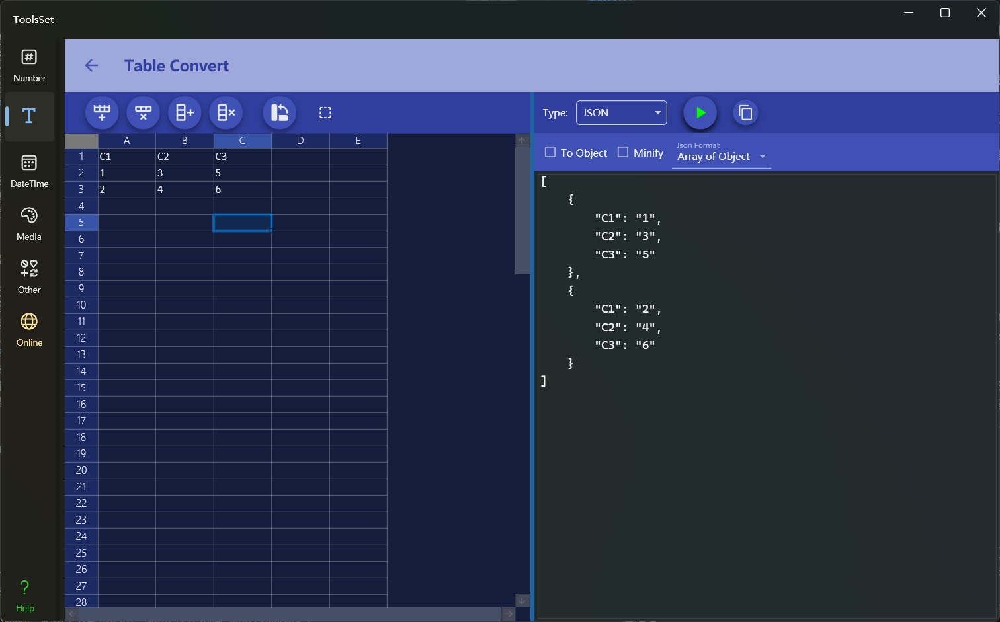

## Introduce

This tool can convert the data in the table into text in Csv, Json, Xml, Html, Markdown, Sql, Yaml, etc

## How to use

The left side is the data input area, and the right side is the data conversion area

* Data entry
  * Enter text in the table on the left, support copying tab-separated data, the first row will be used as the header when converting (if the result requires header data)
  * The four buttons on the left side are: Add Rows, Delete Rows, Add Columns, and Delete Columns
  * The fifth button is the transpose operation, and you can transpose data after clicking
  * On the far right is the selection operation switch, which will convert the data of the selected area when it is turned on, otherwise all data will be converted
* Data conversion
  * In the upper drop-down box, you can select the conversion type, including: Csv, Json, Xml, Markdown, Html, ASCII, Sql Insert, Sql Update, Yaml, C# Object
    * CSV: You can set whether to wrap the data in quotation marks, the type of separator, and the prefix and suffix of each row of data
    * JSON: You can set whether to convert to object, whether to compress, and whether to format the data
    * XML: You can set whether to include namespace, convert to an object, or compress it
    * Markdown: You can set whether to escape, whether to include the title, whether to beautify the alignment, whether to simplify, whether the title is bold, and the alignment
    * HTML: You can set whether to include header, whether to use div tags, whether to compress, whether to use thead and tbody tags
    * ASCII: You can set whether to separate each row, table style, alignment, and comment character type
    * SQL Insert: You can set the table name, whether to generate table deletion statements, whether to generate table creation statements, quotation mark type, and whether to insert them at one time
    * SQL Update: You can set the table name, quotation mark type, and primary key column number
    * YAML: You can set the format of the generated data
    * C# Object: You can set the type name and the type of the generated object
  * Click the Convert button on the right to convert the table data to text in the specified format
  * The rightmost button is used to quickly copy the conversion result
