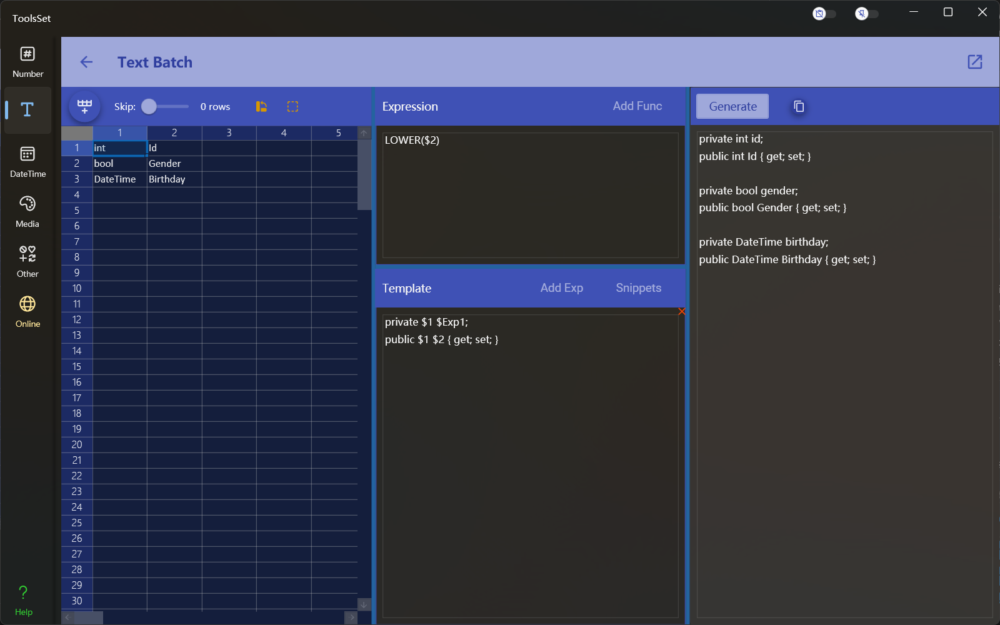

## Introduce

Batch process the text in the table by row, customize the template, and have dozens of built-in functions

## How to use

Enter the text to be processed in the table on the left, you can define the expression and template in the middle area, click [Generte] in the right area to generate the result, and you can click the copy button to copy the result text

* The input area is 200 rows x 50 columns, you can click the button above to add rows, click once to add 100 rows
* The input field can be directly pasted with text separated by tabs, and it will be automatically separated into columns by tab

### Expression and template introduce

1. The final result is generated from template, and the expression can be used in the template
2. Expression can use built-in functions, enter an expression per line, and used in the template with *\$Exp + line number*, for example, *\$Exp 1* represents the first expression
3. Built-in functions cannot be used directly in template, only through expressions
4. *\$+column number* represents the contents of a cell and can be used in both expression and template. For example, *\$1* represents the contents of the first column of cells in each row
5. When the cursor is in the expression text box, the Add Function button on the right is available, you can click this button to view the built-in function, hover over the function to view the function description, and click the function to insert it at the cursor
6. When the cursor is in the template text box, the Add Expression button on the right is available, which can be clicked to select the expression to insert at the cursor
7. When the generation is executed, the template is replaced for each row in the table on the left, and the functions in the template are automatically calculated. For example, you can use the input in the image above to quickly generate the property definition code for the C# entity class