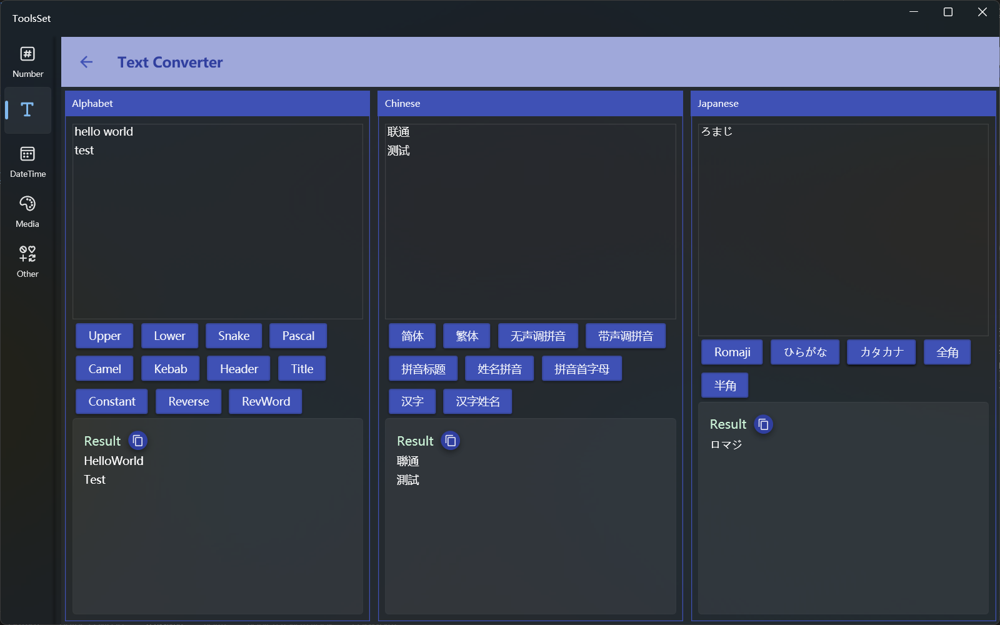

## Introduce

Provide English case conversion, Chinese simplified and traditional, Chinese pinyin, Japanese hiragana and katakana conversion, etc

## How to use

The left side is the alphabet conversion area, the middle is the Chinese conversion area, and the right side is the Japanese conversion area

### Alphabet conversion

  * Upper: e.g., Hello World -> HELLO WORLD
  * Lower：e.g., Hello World -> hello world
  * Snake：e.g., Hello World -> hello_world
  * Pascal：e.g., Hello World -> HelloWorld
  * Camel：e.g., Hello World -> helloWorld
  * Kebab：e.g., Hello World -> hello-world
  * Heder：e.g., Hello World -> Hello-World
  * Title：e.g., hello world -> Hello World
  * Constant：e.g., Hello World -> HELLO_WORLD
  * Reverse：e.g., Hello World -> hELLO  wORLD
  * RevWord：e.g., Hello World -> World Hello
  
  > Snake, Kebab, Heder, Constant, these four conversion automatically divide words by letter case

### Chinese conversion

  * 简体: Conversion of Chinese Traditional to Simplified, e.g., 测试 -> 測試
  * 繁体: Conversion of Chinese Simplified to Traditional, e.g., 測試 -> 测试
  * 无声调拼音: Convert Chinese to pinyin without tone, if it is polyphonic word, all pinyin will be displayed in square brackets, e.g., 重量 -> [zhong, chong] liang
  * 带声调拼音: Convert Chinese to pinyin with tone, if it is polyphonic word, all pinyin will be displayed in square brackets, e.g., 重量 -> [zhòng, chóng] [liàng, liáng, liang]
  * 拼音标题: Convert Chinese to pinyin without tone and capitalize, if it is polyphonic word, all pinyin will be displayed in square brackets, e.g., 重量 -> [ZHONG, CHONG] LIANG
  * 姓名拼音: Convert **one Chinese character** to pronunciation in name, e.g., 单 -> shàn
  * 拼音首字母: Convert Chinese to the first letter of pinyin, if it is polyphonic word, all pinyin will be displayed in square brackets, e.g., 重量 -> [z,c] [l]
  * 汉字: Convert **one pinyin** to Chinese character, including all Chinese characters starting with the pinyin, e.g., sen -> 僧 幓 曑 森 椮 槮 穼 篸 罧 蔘 襂 鬙
  * 姓名汉字: Convert **one pinyin** to Chinese for name, including all Chinese characters starting with the pinyin,  e.g., si-> 斯 司 司空 司寇 司马 司徒 似 姒

### Japanese conversion

  * Romaji: Convert hiragana or katakana to romaji, e.g., わたし -> watashi
  * ひらがな: Convert romaji or katakana to hiragana, e.g., watashi -> わたし
  * カタカナ: Convert romaji or hiragana to katakana, e.g., watashi -> ワタシ
  * 全角: converts half-width characters to full-width characters, e.g., （カタ） -> (ｶﾀ)
  * 半角: converts full-width characters to half-width characters, e.g., (ｶﾀ) -> （カタ）
  
> All the conversion result can be copied to the clipboard by click the copy button