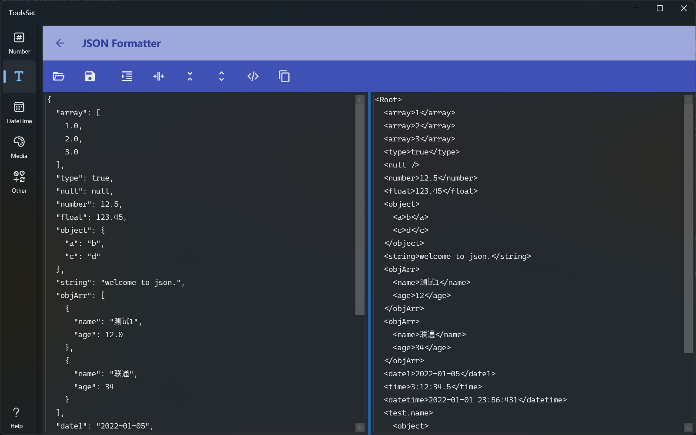
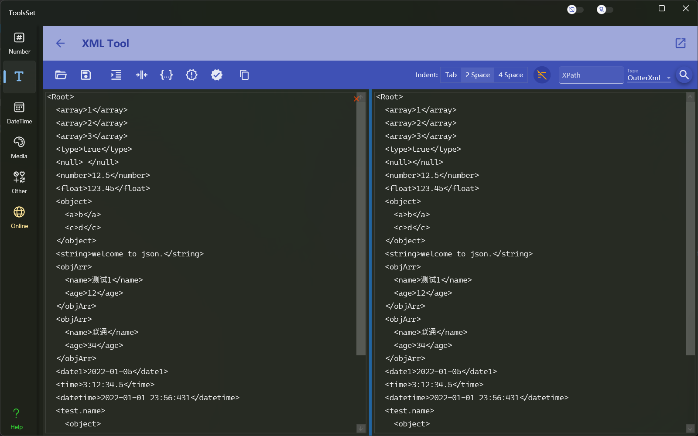

## Introduce

The Json tool provides Json format, compress, flatten, and convert to XML, and the XML tool provides xml
 format, compress, convert to Json and XPath search

Json Tool:

XML Tool:

## How to use

The use of both tools is very simple, just need to click the button on the toolbar
> Supports three ways to provide input: open Json file, paste text, and enter text
> 
> Both tools support save the result to file and copy the result
>
> The XPath lookup result of the XML tool can be displayed in three ways: OutterXML, InnerXML and InnerText
