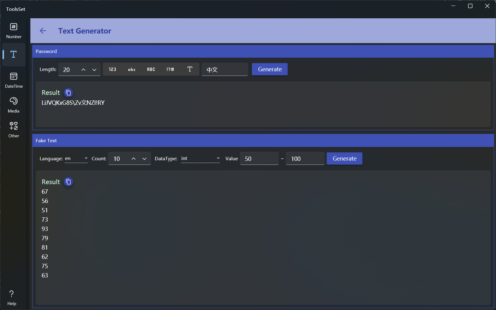

## Introduce

It provides generate random password and fake text according to specified rules

## How to use

The upper part is the random password generation area, and the lower part is the fake text generation area

### Generate password

* Rule settings
  * Length: The range is 1~256
  * Character: Select the character type from the list on the right, you can select more than one. Types include: number, lowercase letter, uppercase letter, special character, and custom character
    > Type without selection has the same effect as all selected
* After the rule is set, click the generate button to generate a random password with specified length and contains specified characters, and you can click the copy button to quickly copy

### Generate fake text

1. Select Language: The drop-down list provides 12 predefined languages to choose, and the selected language will be in English if it does not exist in the specified data type
2. Set the quantity: the range is 1~200
3. Select data type: The data type drop-down box provides more than 30 data types to choose, include commonly used numeric value, string, date and time, Guid, IP, name, color, address, etc
4. Set parameters: You can set value range parameters for numeric type and date type, and length range for string type
5. Generate data: Click the generate button on the right to generate specified count of random text according to the specified rules, and you can click the copy button to quickly copy