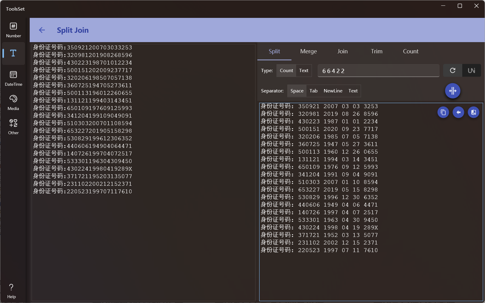

## Introduce

Provides a variety of operations on string, include split, merge, join, trim, count

## How to use

The left side is the text input area, and the right side is the operation area, and the supported operations include:
1. Split: Splits text by a specified number or string, you can specify a separator
   * When the type is specified as quantity, you can enter integers separated by spaces, and the text will be divided sequentially by these numbers, e.g. 123456 is divided by **1 2** and the result is *1 23 4 56* 
     * The options on the right are loop switch and Unicode switch, if the string contains Unicode characters, you need to turn on the Unicode switch, otherwise there may be garbled characters
     * After the loop switch is turned on, it will be split in loop by the number of inputs, otherwise it will only be split once, for example, 123456 divided by **1 2** with **No loop**, The result will be *1 23 456* 
   * When the type is specified as a string, you can split the text with the specified string, and the options on the right will change to ignore case, whole word matching, and use regular expression
     * Split by string will replace the matching string with the specified separator
   * The default separator is a space, but can also be specified as a tab, line break, or custom text

2. Extract: Extract strings from the text that matches the specified regular expression
   * Click the [Regex] button to show a list of commonly used regular syntax, and select an item to add it to the regular text
   * After turning on the [Grouped] switch, you can extract by group, otherwise the whole regular matching text will be extracted
   * The [Named] switch is used to control whether to extract all groups or only named groups, and do not only use numbers when naming groups
   * You can specify that the extracted content separator is a space, tab, line break, or custom text 

3. Merge: Deletes or merges multiple consecutive specified texts into one
   * Merge text is a space by default, which can be specified as tabs, line break, blank or custom text, and supports multiple selection
     * Whitespace includes space, tab, and line break
     * Custom text supports "\" escape character
   * If you specify to merge into one, you can specify that the target text is a space, tab, line break, or custom text

4. Join: Merge multiple lines of text with the specified string
   * You can specify the merged character as space, tab, or custom text, and custom text supports the "\" escape character

5. Trim: Deletes the specified string at start or end
   * You can specify the position as start, end, or both of them
   * By default the remove character is space, you can also specify it as blank or custom text, custom text supports "\" escape character

6. Count: Counts the number of strings specified in the text
   * When the input text changes, the number of characters, spaces, line breaks, English letters, words, numbers, punctuation, symbols, and Chinese will be counted
   * Click the Count button to count the number of specified strings, and the specified strings support the option to ignore case, whole word matching, and use regular expressions
   * When you click the Count button, the text box below will display the count of all Ascii characters, and the top 100 characters and their count in the entered text

> The three buttons in the top right corner of the result text box are:
> 1. Copy Result: Copy the result to the clipboard
> 2. Continue editing: Copy the result to the left text box to edit
> 3. Compare Text: Open the Compare window to compare the result and the input