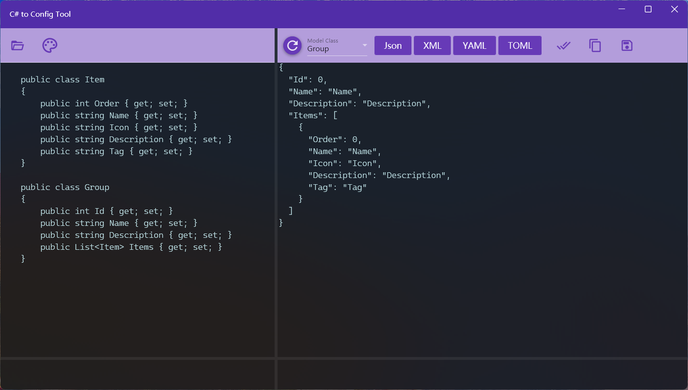

## Introduce
C#2Config is a Windows application that converts C# entity classes into strings in four formats: Json, XML, YAML and TOML, and has the functions of inspecting C# class code and identifying entity classes, open class from a file or paste code, check the converted and modified text content, and saving the conversion result as a configuration file.

This application can be used in various situations where you need to generate Json strings or configuration files based on C# entity classes, such as generating Json requests based on DTO during API testing, or reading configuration files during development and testing.

## How to use
1. Enter the C# class code: You can click the [Open] button on the left to open the entity class from the .cs file, or paste the class code in the left text area.
   > The app has added references of "Newtonsoft.Json"、 "System.Text.Json" and "System.Runtime.Serialization", so you can use the features of these three libraries in your C# code, such as property renaming, specifying order, and so on.

   > You can use the button besides [Open] button to change the text color of the text box.

2. Parse class code: Click the [Refresh] button on the right to parse the class definition code, and the entity class will be verified when parsing, and if there has any error, a message will be displayed at the bottom of left area.
3. Select a class to convert: After the parsing is complete, you can select the class to be converted in the drop-down list.
4. Convert format: Click the button on the right to convert the class code into a configuration string in the corresponding format.
5. Adjust the content: The initially generated configuration data is the default data of each field, and you can modify the data content on the right side as needed, such as modifying the numeric value or increasing the count of list and dictionary data by copying.
6. Verification result: After the modification is completed, you can click the verification button on the right to verify the configuration content, which means that the content can be deserialized into objects.
7. Use result: Click the button on the right to copy the text or save it as a file.

## Requirements and Restrictions
* Convert one class at a time
* All referenced classes need to be in one file
* Entity classes need to be syntactically correct and can be compiled
* A single child element is generated when the list and dictionary type are not initialized, and needs to be copied manually when need more

The XML conversion effect is as follows:

[Microsoft Store](https://apps.microsoft.com/detail/9P7FCM5T6BXZ)