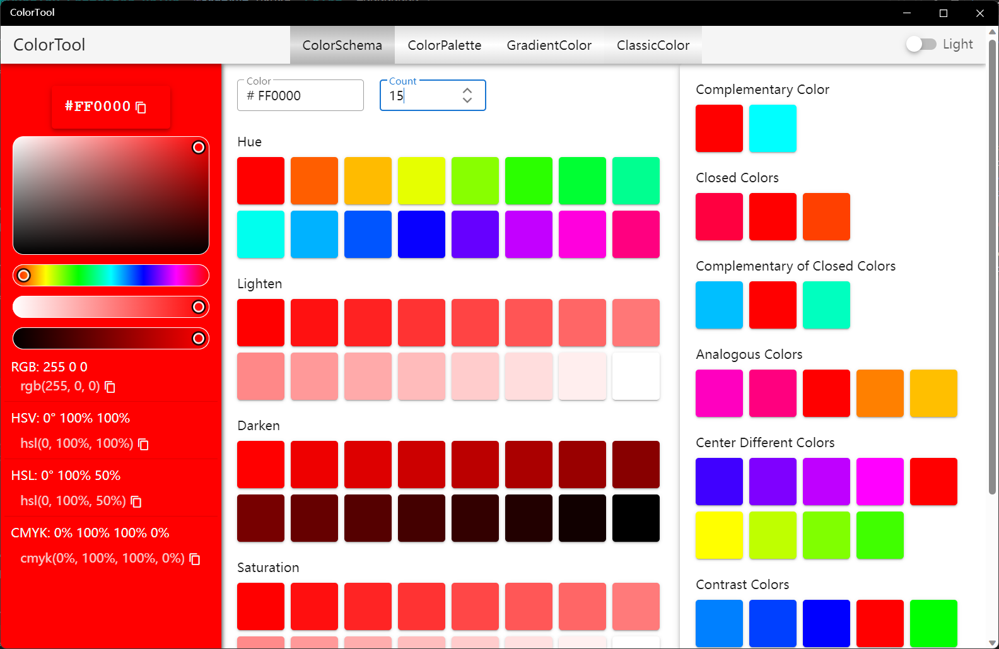
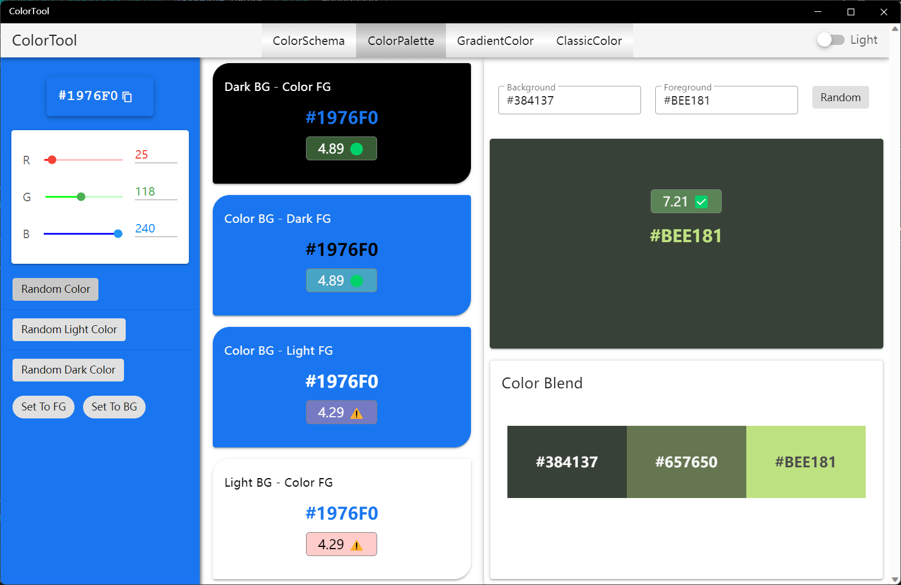
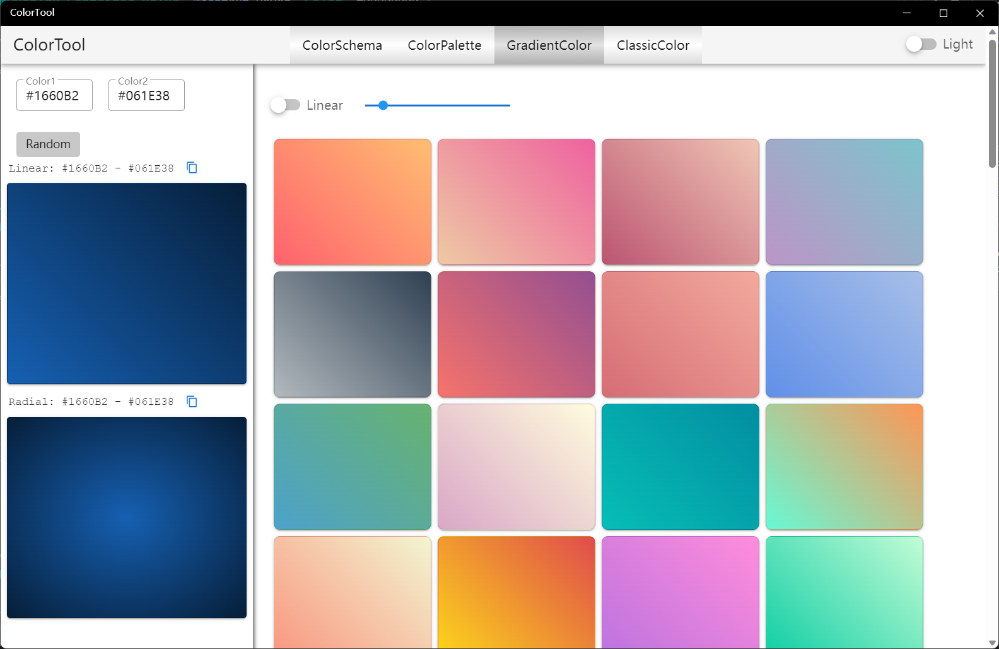
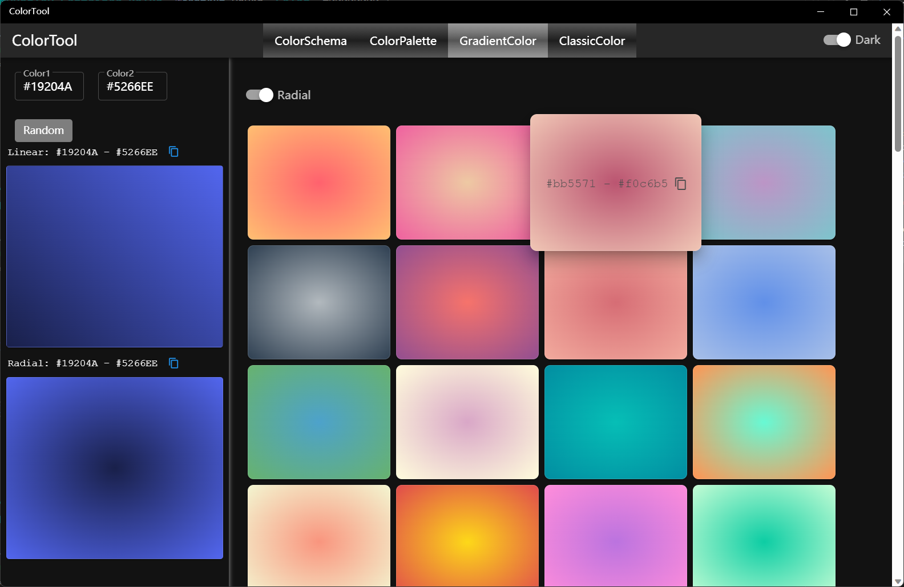
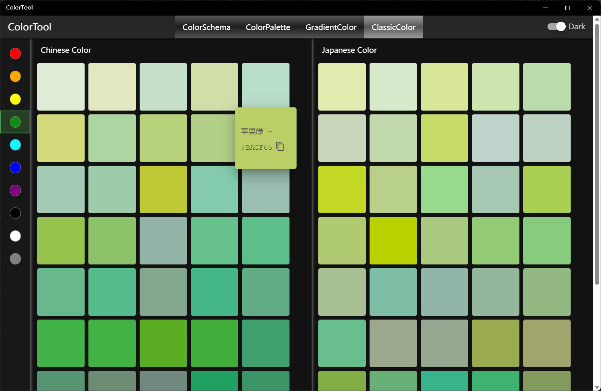

## Introduce

A collection of color tools that includes color selection and palettes, color contrast, color mixing, gradient lists and generation, traditional Chinese and traditional Japanese colors, and more.

1. ColorSchema
   * Supports generating a specified number of hue, lighten, darken, and saturation colors
   * View contrast colors, closed colors, analogous colors, and more
   * Gets color values for multiple color spaces
2. ColorPalette
   * Contrast the display of the specified color as the background and the foreground color on a black/white background/foreground color
   * Specify a random color/light/dark color and use it as a background/foreground color to contrast
   * View the WCAG values for the contrast of the two colors
   * Specify two colors or two random colors to get mixed color values
3. GradientColor
   * View a list of predefined gradient colors
   * Generates a gradient based on two specified or random colors
   * Linear gradients and radial gradients are supported
4. ClassicColor
   * Traditional Chinese color palette
   * Traditional Japanese color palette

## How to use
### ColorSchema

1. Choose color: Choose from the color palette on the left, or enter the Hex color code in the text box at the top of the middle.
2. Copy color codes: The color values of various color spaces are displayed at the bottom of the left, which can be copied using the Copy button to the right of the color value.
3. View gradient colors: After the count is modified, you can view the colors of a specified number of gradients, including hue, lighten, darken, saturation, and value
4. View color schemes: The right side shows the various color schemes, from top to bottom: Complementary, Closed, Complementary of Closed, Analogous, Center Different, Contrast

### ColorPalette

* The effects that can be viewed in the middle area include:：
  * Black Background - Specified color text
  * Specified color background - black text
  * Specified color background - white text
  * White Background - Specified color text
* Specify the color method:
  * Set the color via the left RGB slider or input box
  * Click [Random Color] to set a random color
  * Click [Random Light Color] to set a random light color
  * Click [Random Dark Color] to set a random dark color
* Color contrast and mixing
  * Enter the background color and foreground color at the top right, and the display effect and WCAG value of the two colors will be displayed at the bottom, and the two colors and their mixing results will be displayed at the bottom
  * Click [Random] to set two random colors
  * On the left side, set the color via the slider or input box, and then click "Set To FG" to set the specified color as the foreground color
  * On the left side, set the color via the slider or input box, and then click "Set To BG" to set the specified color as the background color

### GradientColor

* Specify a color gradient: Enter two colors in the text box at the top of the left, and the gradient effect of these two colors will be automatically generated below, including linear gradient and radial gradient
* Random Color Gradient: Click the [Random] button on the left to generate a gradient with two random colors
* Copy Gradient CSS Code: Click the Copy button to the right of the gradient color below to copy the CSS code for a linear gradient or radial gradient
* View the gradient color list: the right side shows more than 80 predefined gradient colors, you can switch the linear gradient or radial gradient with the switch on top, and the linear gradient can change the angle through the slider. Hover on a color and you can click the copy button to copy the CSS code for that color.

Radiant gradient effect in dark theme:

### ClassicColor

* You can filter the palette by color via the color toolbar button on the left
* When hovered on the mouse, the color name and the color Hex value can be displayed
* Hover on and click the copy button to copy the color Hex value

> You can switch between light and dark themes by the switch on the right of the toolbar

[Microsoft Store](https://apps.microsoft.com/detail/9P102NQ0CWX8)