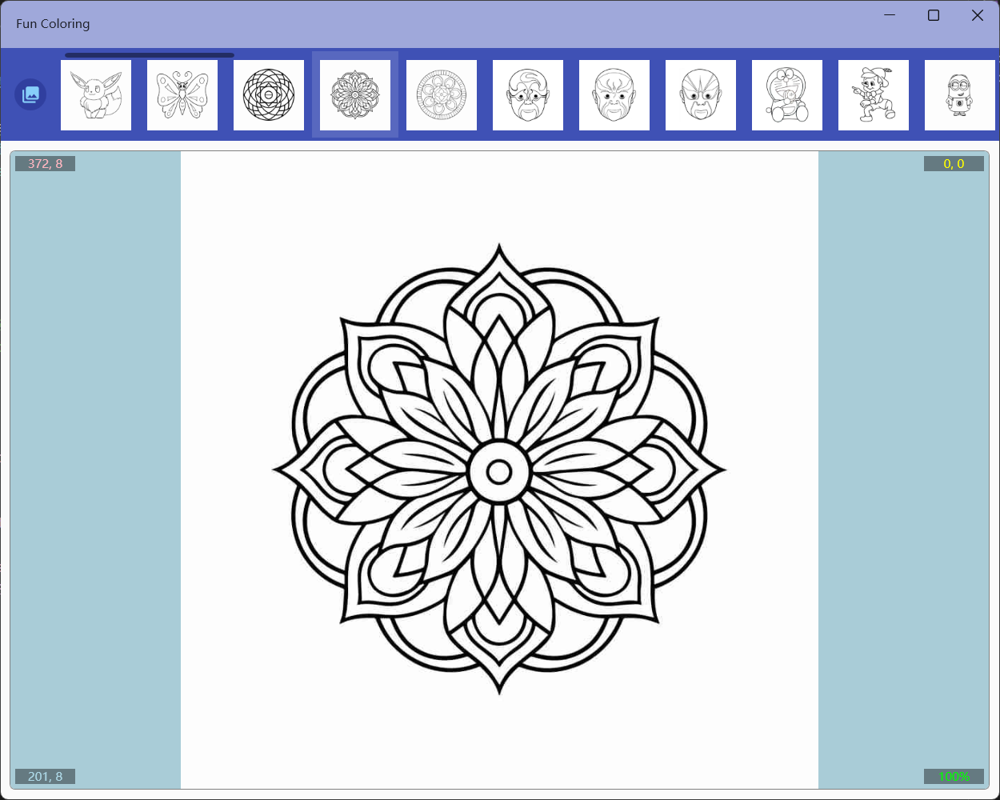
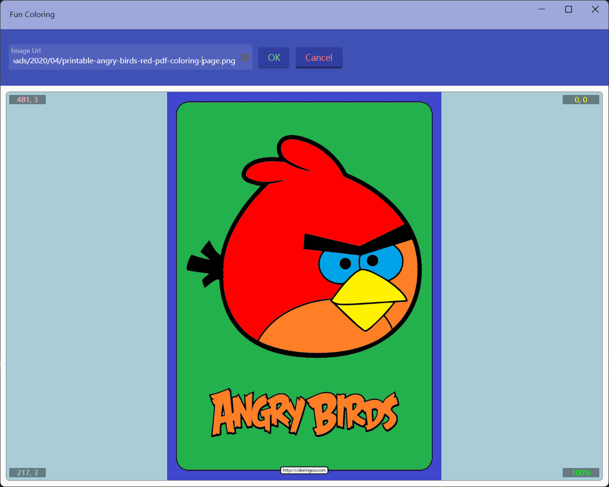
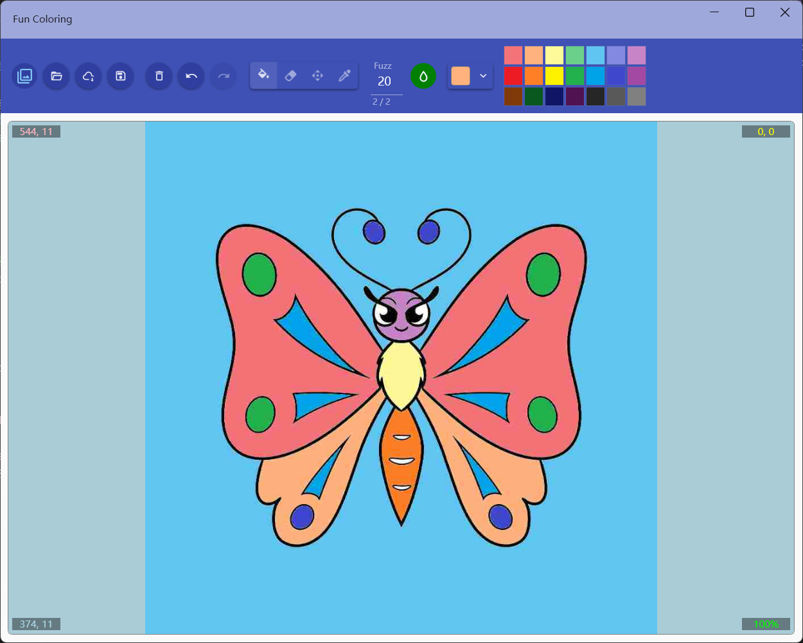

## Introduce

This application contains more than 50 sample pictures of various types, supports opening local pictures or network pictures for coloring, can zoom and pan the picture and fill in continuously, and can save the coloring results as jpg files.

## How to use
The first 4 buttons in the top toolbar are file operations, and their functions are as follows:
* Toggle the display of the list of sample images
* Open a local image
* Open the web picture
* Save the picture

Select an example image:

Coloring web image:

Once the image is opened, you can use other buttons in the toolbar to fill in the color. You can do the following:
* Clear all fills
* Undo and redo
* Switch Mode:
  1. Fill mode: use left mouse button to fill, right button to drag
  2. Clear mode: use left mouse button to clear the fill, right button to drag
  3. Movement mode: use left mouse button to drag, right button to fill
  4. Color mode: use left mouse button to set the current color to the color at the click coordinates, right button to drag
> The drag function is only available when the canvas is zoomed in
>
> **The black color is locked and cannot be filled and removed when filling**
* Set fuzz range: it is used to set the similar color range when filling, the smaller the value, the more accurate it is, the range is 0~99.
* Continuous filling switch: after it is turned on, it can be continuously filled, the fillable area is the same color area as the clicked position and white area, and you can press and drag the mouse to fill all the fillable areas with the specified color.
* Color selection: You can select a color with a color palette in the drop-down box, or you can click the color palette on the right to quickly specify it.

## Hot Keys
* Ctrl+o  Open the local file
* Ctrl+u  Open the network URL
* Ctrl+s  Save to local file
* Ctrl+c  Toggle continuous mode
* Ctrl+f  Switch to fill tool
* Ctrl+e  Switch to cleanup tool
* Ctrl+m  Switch to move tool
* Ctrl+p  Switch to color picker
* Ctrl+z  Undo
* Ctrl+y  Redo
* Ctrl+delete  Clear the fill
* Ctrl+r  Reset the size and position
* Ctrl+n  Restore the picture to original state
* The mouse wheel can zoom in and out of the canvas

[Microsoft Store](https://apps.microsoft.com/detail/9NMDVK2Z3D9P)