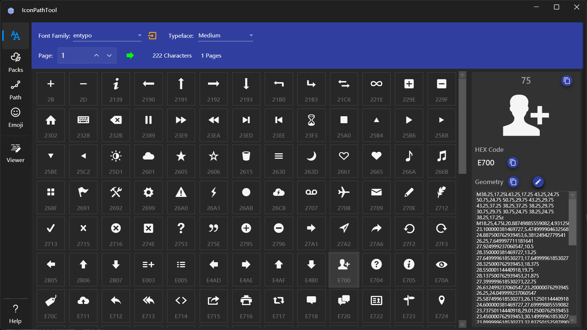
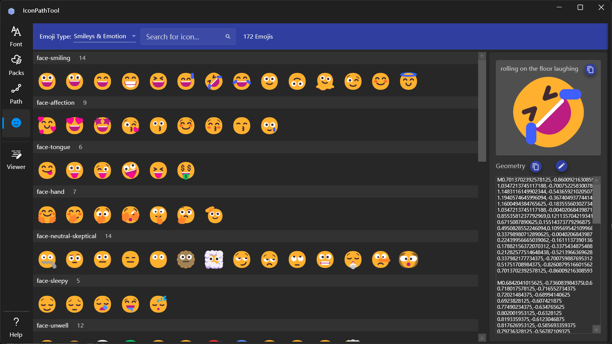

## Introduce
Icon path viewing and editing tool, including tens of thousands of icons such as font icons, path icons, and Emoji icons. It supports loading font file to view characters, converting characters and icons into geometric paths, and saving geometric paths as SVG and PNG files.

## How to use
The tool's left-side navigation include five menus: view font icons, icon packs, path icons, Emoji icons, and geometric path.

### View font icons

1. Select Font Family: The dropdown on the left side of the top menu bar is used to choose a predefined icon font. You can also click the button on the right side of the dropdown to open the font file and view the characters it contains.
2. Select Typeface: After selecting a font, you can choose the supported typeface from the dropdown on the right.
3. View Characters: Once the font and typeface are selected, the list below will display all icons contained in the font in pages. You can enter a value to jump to a specific page. Clicking on a character allows you to view its information on the right, where the character, character code, and path code can be quickly copied using the copy buttons.
4. Edit Path Code: Click the edit button above the path code on the right to open the edit window for modifying the path code. The operations in the edit window are consistent with those in the navigation path viewer.

### View icon packs

1. Select Icon Pack: The dropdown menu on the left side of the top menu bar is used to select an icon pack, including commonly used icon packs such as Material, FontAwesome, and FluentSystem.
2. Search Icons: You can enter text in the text box to the right of the dropdown to search for icon names.
3. View Icons: Click a character to view icon information on the right, where the name and path code can be quickly copied using the copy button.
4. Edit Path Code: The operation method is the same as for font icons.

### View path icons

1. Select Icon Type: Use the dropdown menu on the left side of the top menu bar to choose the icon type, including categories such as Application, Education, Food, Office, Shape, Animal, etc.
2. Search Icons: You can enter text in the text box on the right side of the icon pack dropdown to search for icons by name.
3. View Icons: Click a character to view icon information on the right side, where the path code can be quickly copied using the copy button.
4. Edit Path Code: The operation method is the same as font icons.

### View Emoji

1. Select Emoji Category: Use the dropdown menu on the left side of the top menu bar to choose an Emoji category, including smileys, food and drink, animals and plants, symbols, and more.
2. Search Icons: You can type text in the textbox to the right of the icon pack dropdown to search for icon names.
3. View Icons: Click on a character to view icon information on the right, where the name and path code can be quickly copied using the copy button.
4. Edit Path Code: The operation method is the same as for font icons.

### View geometric path

* View and Edit Path: Enter the geometric code in the left text box, if the code is incorrect, an error message will be displayed below
* Simplify the path: you can set the accuracy of the path coordinates at the top right end of the left side, click the button on the right to update the content in the text box after set the precision, and the button on the far right can quickly copy the text
* Path settings: You can modify the settings at the top of the right side, including the width and color of the border, whether it is filled, and the fill color can be set after the fill is enabled
* Save Result: The three buttons on the upper right side can be used to: copy SVG string, save SVG file, and save PNG file

[Microsoft Store](https://apps.microsoft.com/detail/9PC0RM0C9GCQ)