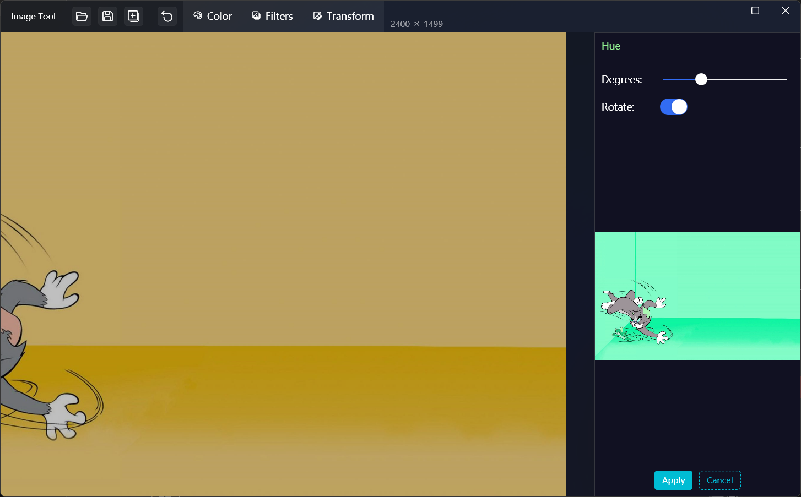
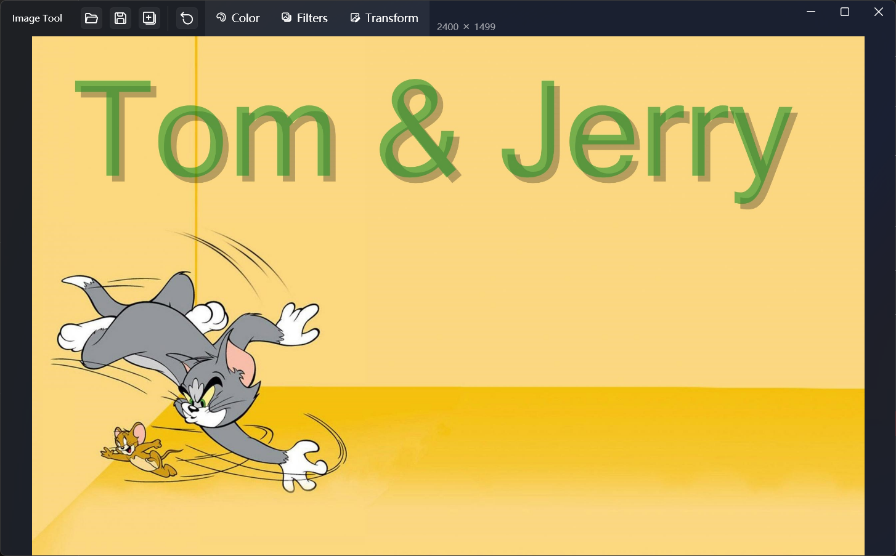

## Introduce
A simple and easy-to-use image editing and processing tool, which supports color adjustment, filtering, and transformation of pictures, and the 4 buttons on the left side of the menu bar can open the picture, save the picture, save a copy, and reset the picture.

> When you operate in the menu, the preview will be opened on the right side of the window, and the effect will be applied to the left side when you click the Apply button.

### Color menu
Color adjustments can be made, including:
* BackgroundColor: You can set the transparent background in PNG format to the specified color
* Brightness: Adjust the brightness of the image
* Contrast: Adjust the contrast of the image
* Saturation: Adjust the saturation of the image
* Hue: Adjust the hue of the image, and Rotate can set whether to adjust it to one hue or not
* Tint: Adjust the overall color by adding a mask of the specified color to the image
* Gray: Decolorize the image and turn it into grayscale
* BlackWhite: Turn the image into black and white mode
* Invert: Invert the picture
* ReplaceColor: Replace one specified color in the picture with another color, and you can set a tolerance value
  

### Filters menu
You can add filters to the pictures, including:：

* DetectEdges: Find edges of an image based on the specified algorithm type, which can be specified as grayscale mode
* Comic: Transform image into comic effects
* Gotham: Convert image to advanced dark gray tones
* HiSatch: Converts the image to a high saturation effect
* LoSatch: Converts the image to a low saturation effect
* Lomograph: Add a Lomo graph effect to the picture with the corners darkened
* Polaroid: Add a Polaroid effect to the picture with the corners darkened
* Sepia: Transform the image into a nostalgic effect of dark brown
* GaussianBlur: Add a Gaussian blur effect to an image
* GaussianSharpen: Gaussian sharpening of the image
* Pixelate: Pixelate the image according to a specified pixel size, and you can specify the entire image or a local area
* Vignette: Adds a glow effect of the specified color to the image
* Gamma: Gamma adjustments are made to the picture
  

### Transform menu
Images can be transformed, including:

* Alpha: Adjust the alpha of the image, which needs to be supported by the image format (e.g. png format)
* Rotate: Rotate the image at a specified angle, and you can set whether to lock the image size
* Resize: Resize the image to a specified size, which can be used in multiple ways
* Crop: Crop the image at a specified position and size, with specify pixels or percentages
* EntropyCrop: Intelligently crop the background blank of an image
* Flip: Flip the picture horizontally or vertically
* Mask: Add a mask at the specified position of the image, and the image will show the opaque area of the mask image
* RoundedCorners: Add rounded corners to an image, you can specify a few or all of the four corners
* Overlay: Overlay another image at the specified position of the image, and you can specify the size and transparency of the image
* Watermark: Add a text watermark to the specified location of the image, and you can specify the font size, color, transparency, and whether there is a shadow
* Format: Change the image format, support Jpeg, Png, Bmp, Gif, Tifff format, Jpeg support to specify the image quality
  

  

[Microsoft Store](https://apps.microsoft.com/detail/9MV16HSW0NLR)