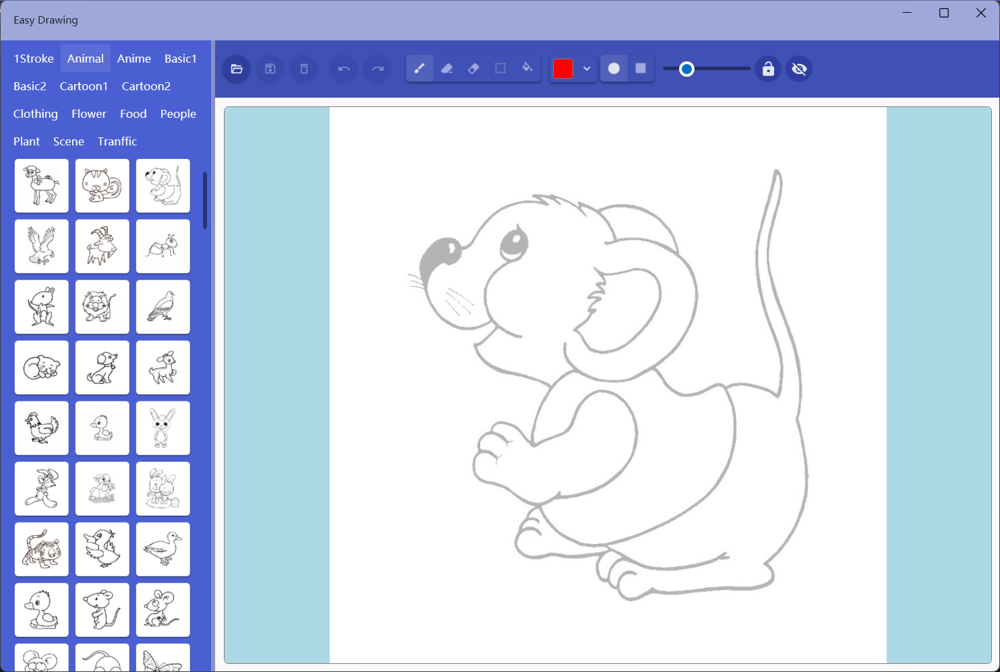
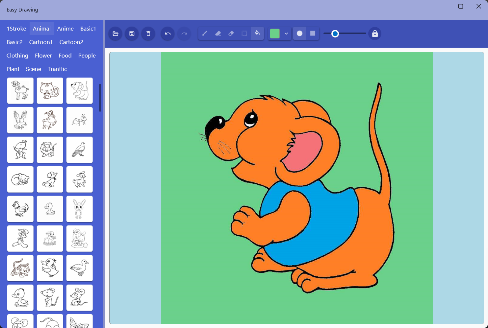

## Introduce
This app contains more than 1500 line pictures of animals, plants, people, vehicles, cartoons and other categories, supports picture tracing and coloring, and can save the drawing and coloring results as files. You can also open local images to trace and color.

## How to use

### Tracing

1. Select the image category on the left
2. Click on the image you want to trace in the selection category to select it
3. Trace on the canvas on the right
> You can also click the [Open] button in the toolbar to open the local image for tracing

The operations that can be performed through the toolbar during the drawing process are:
* Clear Canva: Deletes all lines drawn
* Undo and redo
* Switch modes: Brush Mode, Line Erase, Point Erase, Line Selection, Fill Color
* Set brush color: You can use predefined colors and custom colors
* Set brush shape: oval and rectangle
* Set brush size: One value after locking width and height: side length or radius, otherwise two values: length and width
* Lock width and height: When turned on, the circle will be round or square
* Set basemap visibility: The basemap is not displayed when turned off

### Coloring

Click the mode switch button in the toolbar to enter the fill mode, and the fill image will be displayed according to the canvas status:
* If the canvas has already been painted, the pattern will be filled
* If the canvas is blank, the basemap is used to be filled

After drawing or coloring, you can click the [Save] button in the toolbar to save the image to local file.

[Microsoft Store](https://apps.microsoft.com/detail/9NXD45TW8HMX)