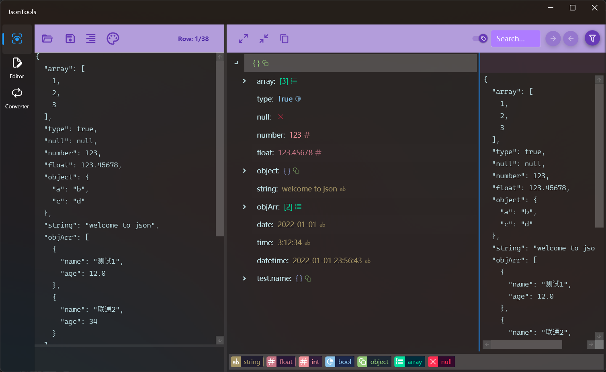
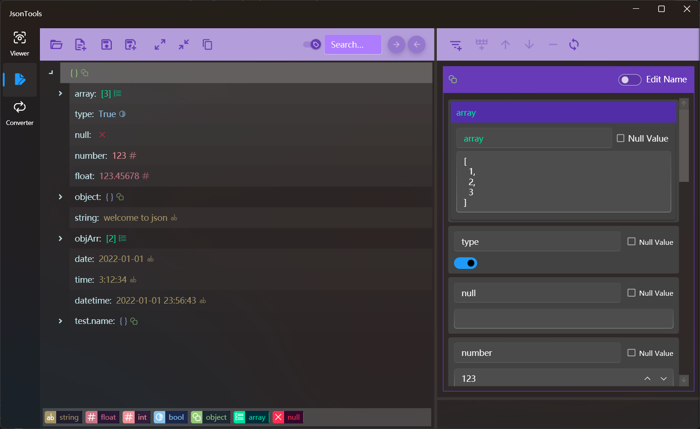
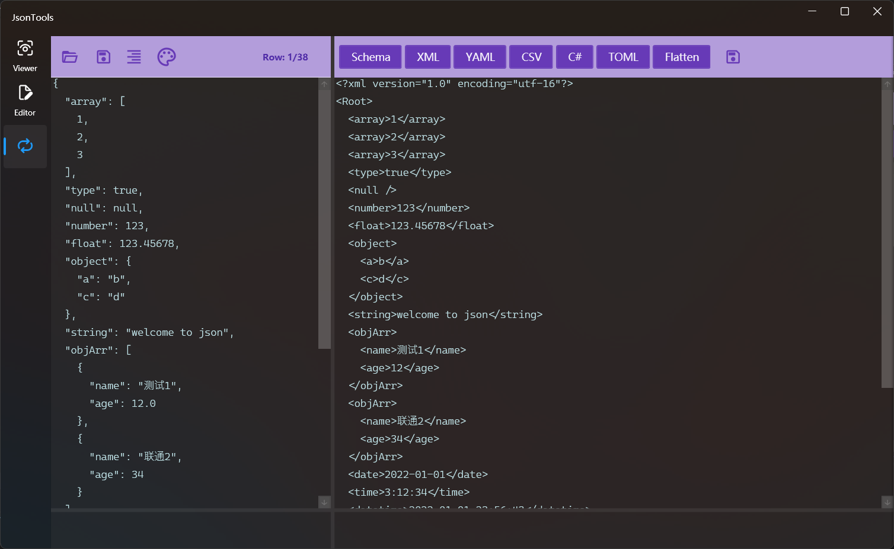

## Introduce

The JSON text processing tool supports view, edit, and multiple conversion functions.

### Viewer
* JSON format verification
* JSON formatting
* Edit Json as text
* View the Json content in a tree structure
* Different colors show different types
* JSON text content lookup
* JsonPath filtering
* Node content viewing and fast copying

> Click the copy button in the middle to quickly copy the contents of the selected node in the tree
>
> Turn off the switch in front of the search box to exclude key names in the search
>
> After selecting a node in the tree, click the header row on the right to quickly copy the node path 

### Editor
* Open an existing Json file or create a new blank Json file for editing
* Tree structure to display content
* JSON text content lookup
* Edit content by node
* Add nodes of the String, Number, Bool, Array, and Object types
* Node clone, move location, delete node
* Edit the node name and value

>! After editing the node content, you need to click the refresh button on the right to synchronize the data to the left tree, otherwise the modification will be lost
>
>! When the value is set to null, the node type will be lost, and the value of null can only be changed to string when changing to a non-null value, and it must be entered

### Converter
* Format check and formatting
* Josn to Json schema
* Josn to Xml
* Josn to Yaml
* Josn array to Csv
* Josn to C# class
* Josn to Toml
* Josn flatten
* Save result to file

>! When the conversion object is an array, the type will be determined according to the first element, so when the format of the array elements is different, sometimes the conversion fails due to the data type, then you need to check whether the data type is consistent, if it is inconsistent, you need to modify the value of the first element according to the situation, so that its data type can include all array elements. For example, change [integer type 12] to [real type 12.0] or [number type 1.4] to [string type "1.4"].

[Microsoft Store](https://apps.microsoft.com/detail/9P198RFZ9RTS)