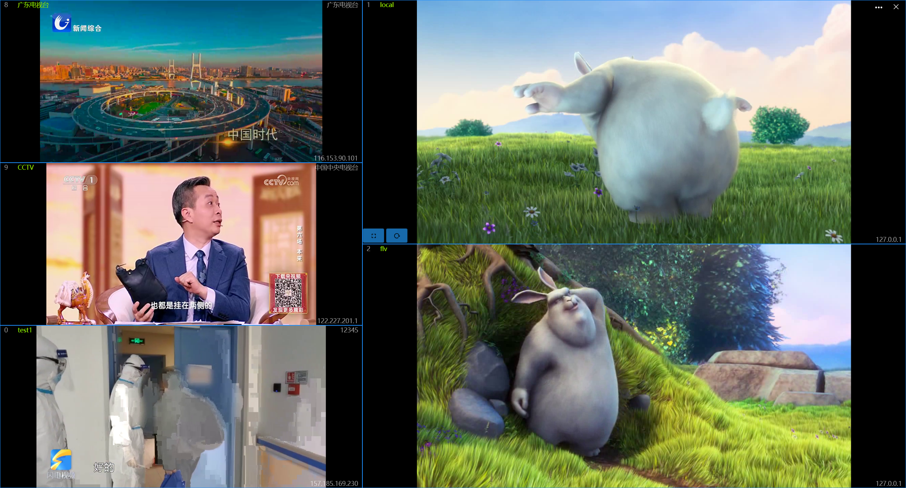
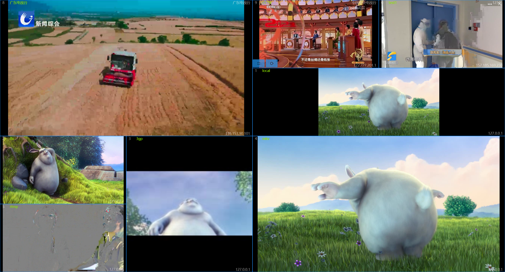

## Introduce
This app is a multi-window video viewing tool, which can be used for multi-window video playback and can also be used as a video surveillance tool. Supports local video files: MP4, FLV, 3GP, MKV, and network video protocols such as RTSP, RTMP, HTTP, and M3U8.

## How to use
When the app first open, it has a left-1-right-1 layout, and there is no video configured, so you need to config the video first.

Click the button to the left of the close button to open the configuration window, where you can configure the video path and window layout.
The functions of the Configure Window title bar control are:
1. Select a window layout
2. Update the window layout to the selected layout
3. Set the automatic switching interval in milliseconds, and the automatic switching will not be triggered when the setting value is less than 1000
4. Automatic switch, the switch is turned on and the interval time is greater than 1 second
5. Full screen sound switch, if you maximize the video after turning it on, you can play the video sound, otherwise it will be muted

### Configure the video
On the left side of the config window is the video config area
* Add a video: Click the [+] button on the top, and the information entry area will appear below, enter the information and click Save.
  > the IP and Url is required
* Edit Video: Select a row in the table to modify the information in that row.
* Delete a video: After selecting a row in the table, click the [-] button on the top, a prompt message will pop up, and click [OK] in the message to delete the record.
>! After the video update, you need to restart the app to take effect

### Configure the layout
To the right of the config window is the layout config area
* Use a predefined layout: You can select a predefined layout in the drop-down box of the title bar of the config window, and click the Sync button on the right to synchronize to the main window.
* Custom layouts：
  1. First, select a predefined layout and modify it.
  2. Click the floating button [+] on the right side, you can click the button in the pop-up menu to adjust the layout, the functions of the buttons from top to bottom are: add column, delete column, add row, delete row, merge cells, split cells.
  3. After the layout is adjusted, enter a new name at the top and click [Save] to save.
* Modify Layout: After selecting the layout above and adjusting it, click [Save] to modify the existing layout without changing the name.
* Delete Layout: After selecting the layout above, click the [-] button on the right to delete the layout.
  >! Layout that is in use cannot be deleted

## Video navigation hotkey

* 【→】: Next video
* 【←】: Previous video
* 【PageDown】: Next page
* 【PageUp】: Previous page
* 【Home】: First page
* 【End】: Last page
* 【Escape】: Restore window
* 【Alt+Enter】: Open the jump window
* 【Alt+Space】: Toggle automatic carousel
* Double-click the mouse on a video to toggle the full screen and window state.

> It only takes effect when the count of videos is more than one page
> 
> Button navigation requires at least 2 seconds intervals

Left 3 Right 2 Layout:

7 windows Layout:

Custom Layout:：

[Microsoft Store](https://apps.microsoft.com/detail/9NCRFPFG5JB3)