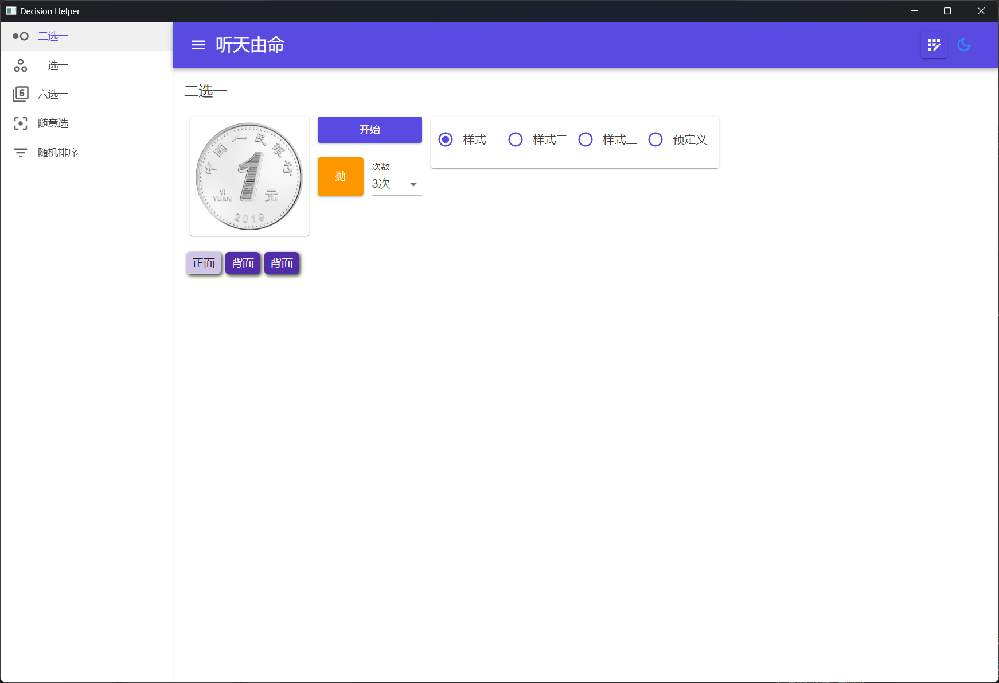
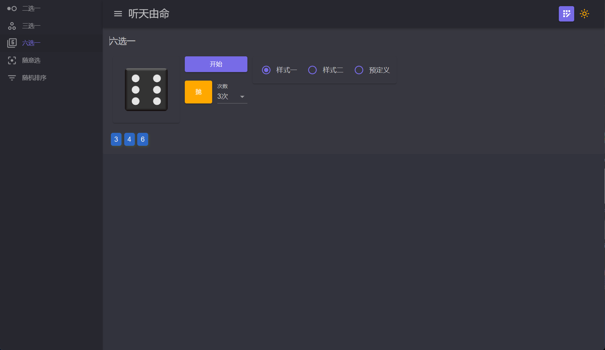
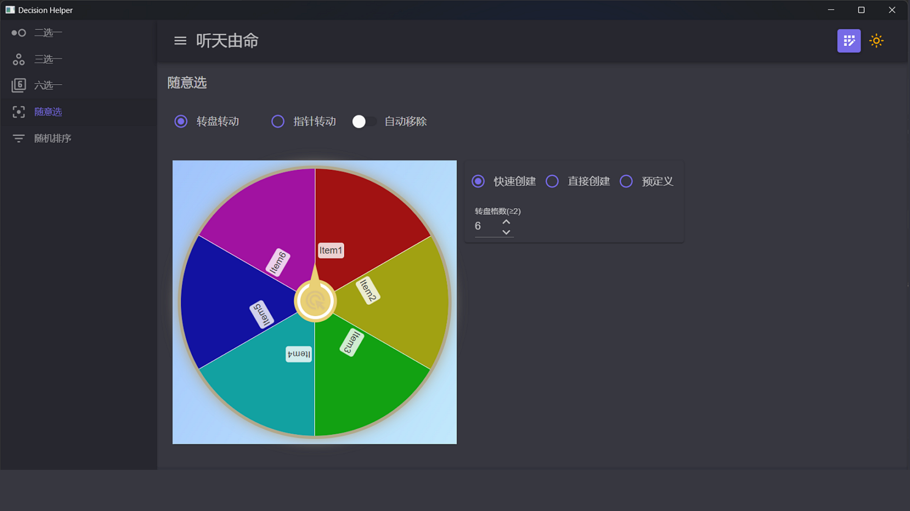
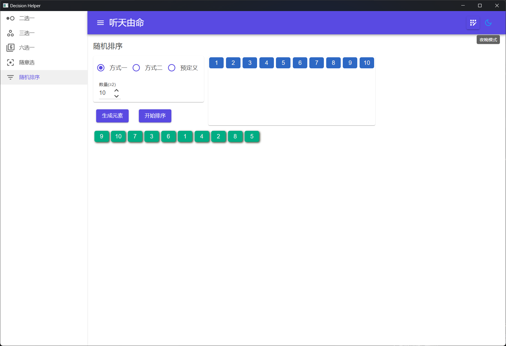
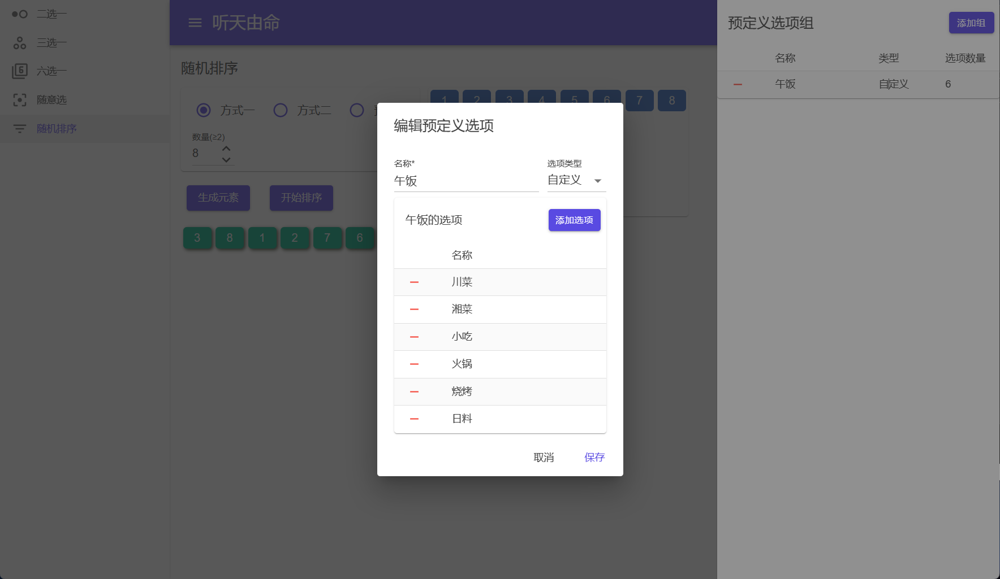

## Introduce
Functions include random two-choice, three-choice, six-choice, turntable, random sorting, each choice provides a variety of ways and styles, the interface supports light and dark theme switching, and supports custom options.

### Two-choice
Choose from two options.
* There are three styles: Style 1 and 2 are two different coin styles with different rotation methods, and Style 3 can specify the obverse and reverse text.
* You can select a predefined list of options in a predefined setting.
* Support multiple throws in a row.

### Three-choice
Choose one from three options.
* There are three styles: style one is rock-paper-scissors; Style 2 is a traffic light, and you can specify text; Style 3 is the turntable, and you can also specify text.
* You can select a predefined list of options in a predefined setting.

### Six-choice
Choose from six options by rolling the dice.
* There are two styles: style one is the ordinary six-point dice style; Style 2: You can customize the text on each side.
* You can select a predefined list of options in a predefined setting.
* Support multiple throws in a row.

### Turntable
Choose from a number of options by spinning the dial.
* You can choose to turn the dial or pointer, and you can choose whether to automatically delete the selection after selection.
* [Quick Create] can be created automatically after specifying the quantity;
* [Direct Creation] You can directly enter the option to create an option;
* [Predefined] You can select a predefined list of options.

### Random sorting
Generate a specified number of options to sort them randomly.
* [Method 1] You can specify the number and then create a number option;
* [Method 2] You can directly enter the option to create the option;
* [Predefined] You can select a predefined list of options.
> After the number or options are changed, you need to click [Generate Elements] first, and then click [Start Sorting] to randomly sort.

### Predefined options
Options can be predefined for all choice ways.
* Click the [Predefined Options] button in the upper right corner to open the predefined option group, and you can operate the predefined group in the interface.
* Add: Click [Add Group], enter the name in the pop-up window, select the type, enter the options and save them, only the custom way can modify the number of options.
* Modify: Click an item in the list of option groups to pop up a window to modify.
* Delete: Click the delete button in front of the list of option groups to open confirmation dialog, click confirm to delete.

Theme switching: The button in the upper right corner of the app can switch the light and dark theme.

[Microsoft Store](https://apps.microsoft.com/detail/9N2S39RTRPB6)

[PWA Version](https://apps.microsoft.com/detail/9PMKD8SSQZH7)

[Use online](https://makedecision.azurewebsites.net)