## Introduce

The app provides a collection of commonly used web apps, divided into normal and pro editions, and users can also customize categories and URLs to save desktop and mobile addresses of popular websites.

### How to use the normal version
#### Home page menu
The functions of the toolbar buttons at the top of the home page are as follows: Category Management, Site Management, Window Background, Label Background, and Mobile Version.

The app comes preset with categories such as music, video, news, finance, shopping, entertainment, and more, with several websites in each category.
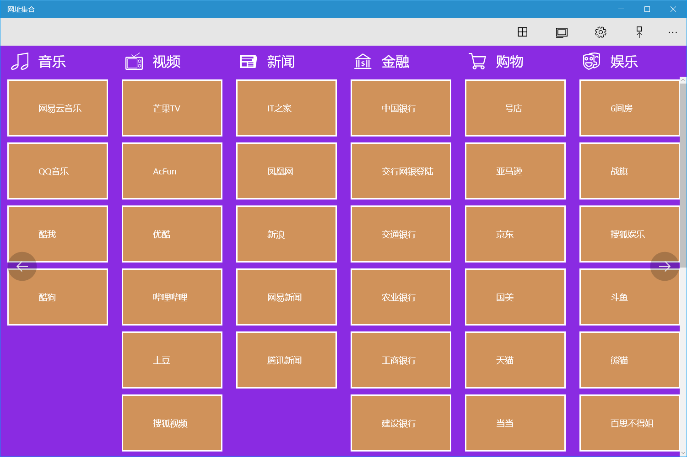
Click on label to go to the site.

After entering the website, the buttons on the right side of the top toolbar are used in order: return to the home, refresh the page, back, forward, and view user information.
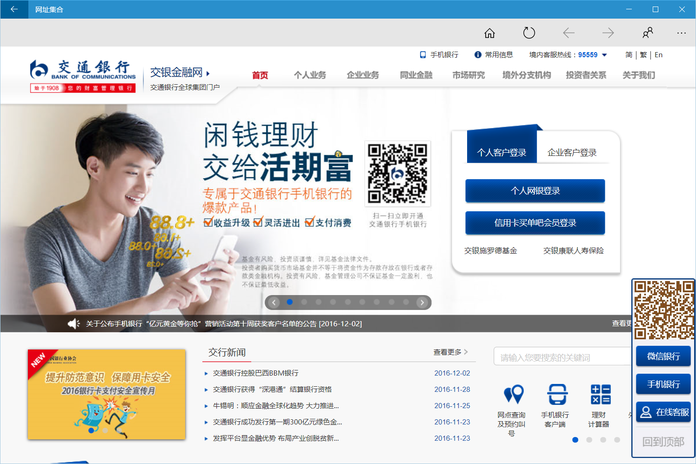
> If mobile version is selected, the mobile address will open if you set a mobile address.

#### Conifg the window style
* Click the Home Background button in the toolbar of the home page to select one of the 25 predefined colors to set the window background color.
* Click the Label Background button in the toolbar of the homepage to select one of the 25 predefined colors to set the label background color. Labels can also be set transparency via sliders.

#### Edit category
Click the Category Management button in the toolbar of the home page to modify the category.
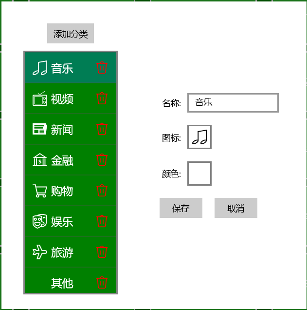
* Add: Click the [Add Category] button, enter the category name, you can select the icon and color, and click [Save].
* Modify: Select a category, you can modify its name, icon and color, and click [Save].
* Delete: Click the delete icon on the right side of the category and click the [OK] button in the dialog to delete the category.
  >! If sites have already been added to the category, you need to delete all sites in the category before delete the category.

#### Edit site
Click the Site Management button in the toolbar of the home page to modify the site.
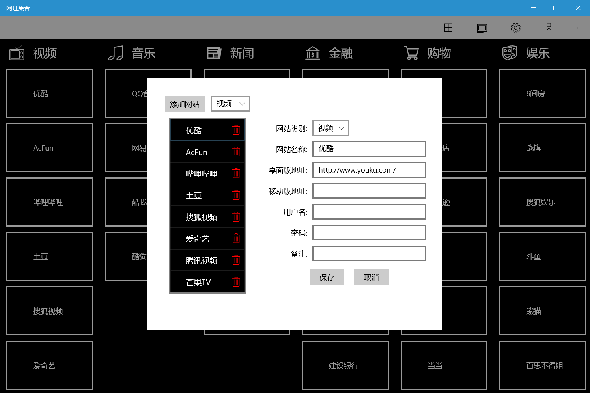
* Add: Click the [Add Website] button, select a category on the right, enter the website name, desktop or mobile address, user information and notes are optional, and click [Save].
* Modify: Select the category in the drop-down box on the left, click the website you want to modify in the selected category, modify the parameters on the right, and click Save.
* Delete: After selecting a category, click the delete icon on the right side of the website, and click the [OK] button in the pop-up dialog box to delete the website.

#### Use User Information

* Edit User Information: You can change the user name, password, and notes in the Edit Website dialog for use when opening a website.
  > For security reasons, it is recommended that passwords should not save plaintext, but save the prompt information of part of the mask.
* Use: After opening the website, click the user information icon in the top toolbar to view the saved information, and you can click the [Copy User Name] button to copy the user name to the clipboard and paste it when needed.

### How to use the pro version
The pro version adds the following features:

1. You can use Bing wallpapers as backgrounds.
2. You can search using Bing or Baidu on the homepage.
3. The color scheme is more abundant, and more options can be customized.
4. Support URL copying, quickly add URLs.
5. You can import and export website settings.

#### Home page menu
The functions of the toolbar buttons at the top of the home page are as follows:  category management, website management, and mobile version.

The search function has been added at the top of the homepage of the pro version, you can select Bing or Baidu in the drop-down box, and after clicking Search, the corresponding web page will be opened to display the search results.

The app preset categories and websites are the same as those of the normal version.
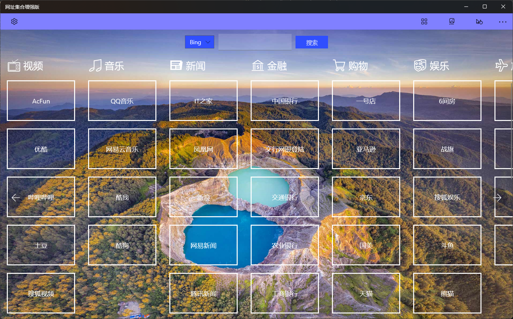
Click on label to go to the site.

After entering the website, the buttons on the right side of the top toolbar are used in order: return to home, copy url, refresh the page, back, forward and user information.
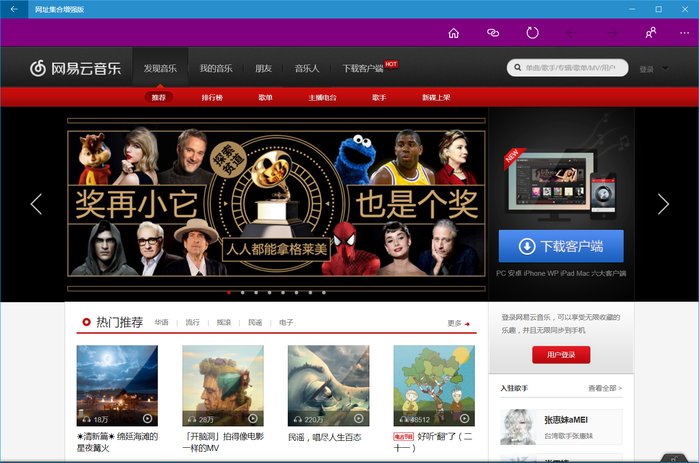
The added [Copy Path] button can copy the current URL to the clipboard.
Other features are the same as those of the normal version.

#### App settings
The pro version adds more settings features, and you can open the settings interface by click the setting button on the left of the toolbar.
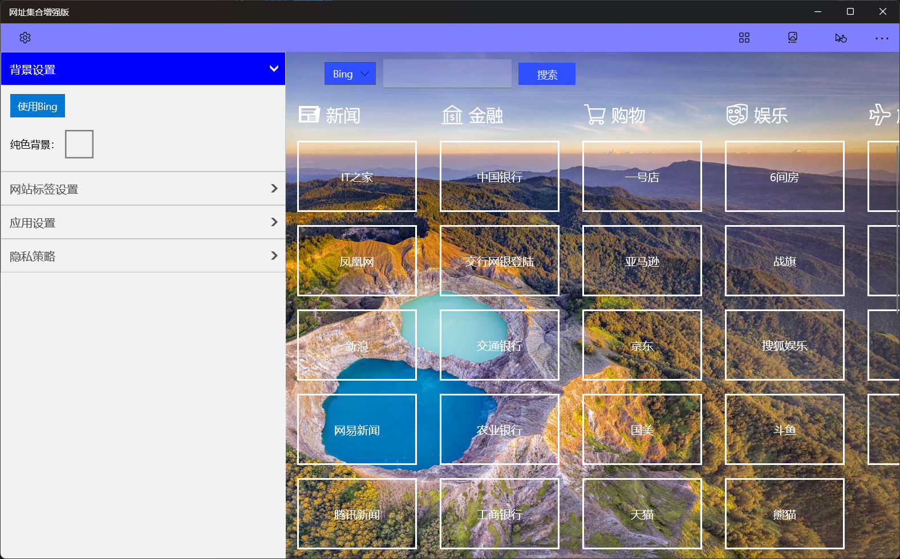
The settings interface includes: background settings, label settings, and application settings.
* Background settings: You can use Bing wallpapers as app backgrounds or use solid backgrounds.
* Label settings: You can set the border width, rounded corners, spacing, size, font size, background color, and foreground color of the label.
  > You can set the values of the border width, rounded corners, and spacing of the label in the four directions of up, down, left, and right respectively
* App settings: You can set the background color and foreground color of the command bar, and the website configuration has been imported and exported.
> Pro version color settings can be selected from 48 basic colors, or you can use a palette of custom colors. The color palette supports ARGB text input and transparency settings.

#### Edit category
The category editing function of the pro version adds the function of adjusting the classification order, and other functions are the same as those of the normal version.

#### Edit site
This feature is the same as that of the normal version.

#### Use User Information
This feature is the same as that of the normal version.

[Microsoft Store](https://apps.microsoft.com/detail/9PLD6M5GCCWV)

[Pro version](https://apps.microsoft.com/detail/9P89C1H8QHH7)

Some custom interface effects:
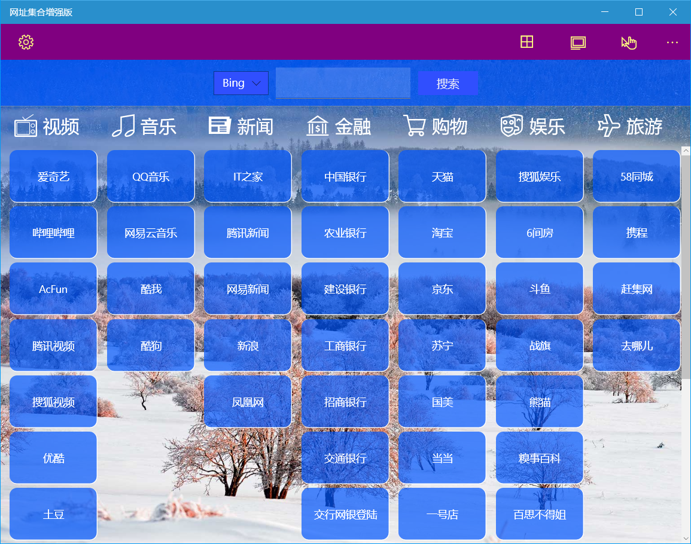

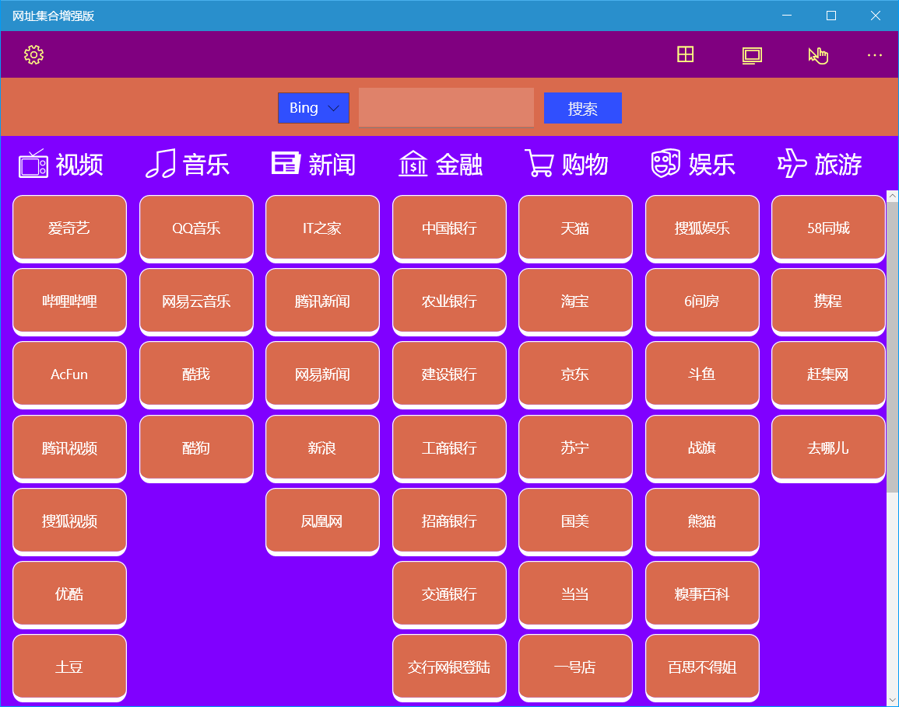

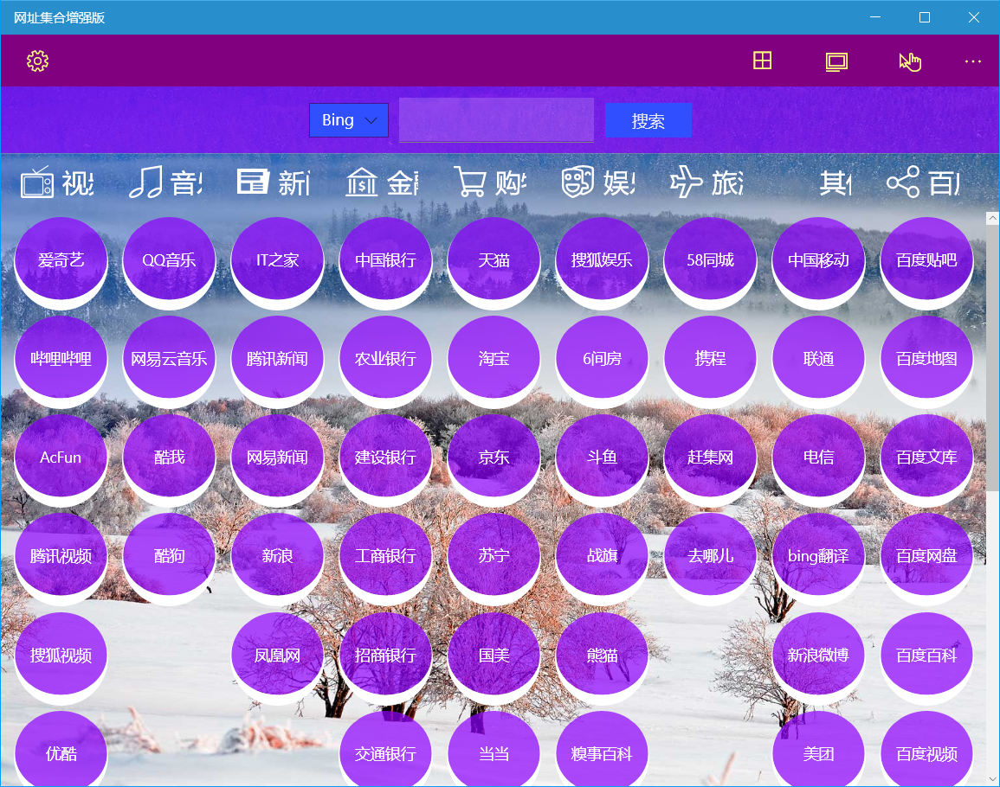

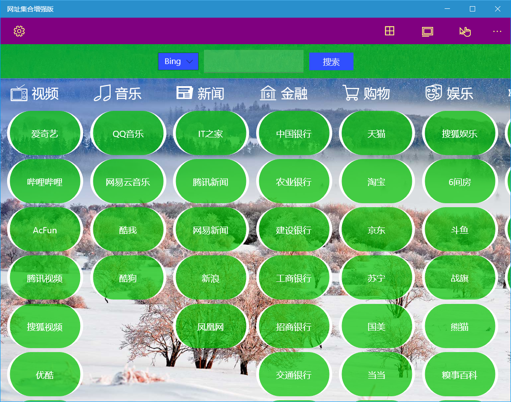

