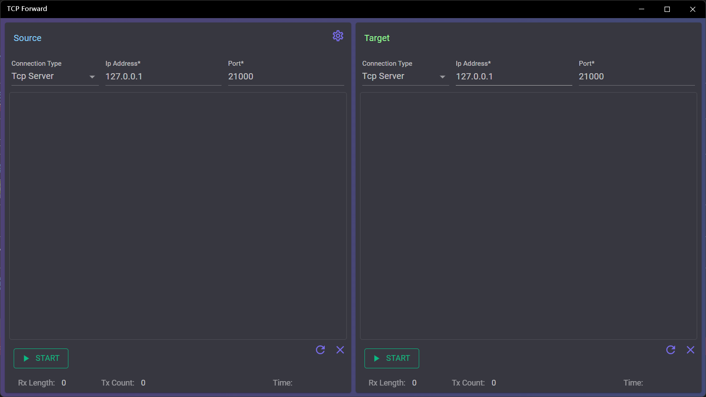
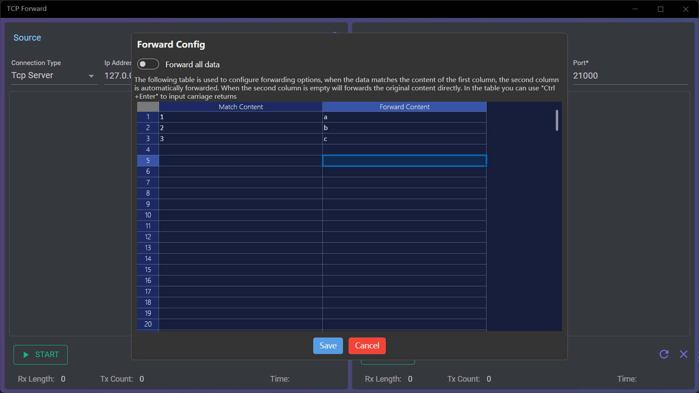
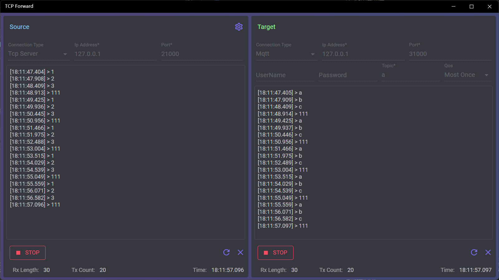

## 介绍
Tcp数据一对一转发工具，接收端支持连接Tcp服务器和客户端，转发目标支持Tcp服务器、Tcp客户端、Mqtt和Websocket，支持自定义映射转发数据。

## 使用方法
界面分为左右两部分，左侧为源，即数据接收端，用于连接数据的来源；右侧为目标，即数据发送端，用于连接数据发送的目标。
### 数据转发设置

1. 配置数据接收端
   1. 选择接收端连接类型
      * 接收端可选连接类型为Tcp Server和Tcp Client
      * Tcp Server用于接收其他Tcp client发送的数据，Tcp Client用于接收Tcp Server的数据
   2. 连接接收端
      * 在文本框输入服务器Ip和端口
      * 对于Tcp Server，Ip不用修改，保持默认的“127.0.0.1”即可
      * 参数设定好之后点击下方【Start】按钮进行连接，成功后按钮会变成【Stop】
   3. 停止接收端
      * 点击【Stop】按钮即可停止
  
2. 配置数据发送端
   1. 选择发送端连接类型
      * 发送端可选连接类型除了Tcp Server和Tcp Client，还可以选择Mqtt和Websocket
      * Tcp Server可将接收到的数据广播到所有连接到此Server的客户端
        > 此方式可实现对多个目标Tcp Client的转发
      * Tcp Client可将接收到的数据发送给其连接的服务器
      * Mqtt会以指定主题发送接收的数据
      * Websocket会将接收的数据发送到指定Path
   2. 连接发送端
      * 对于Tcp Server和Tcp Client，连接方法和接收端一致
      * 连接Mqtt除了需要指定Ip和端口外，还需要指定发送主题和Qos，用户名和密码可以根据需要指定
      * 连接Websocket除了指定Ip和端口，可以根据需要指定Path、用户名和密码
      * 参数设定好之后点击下方【Start】按钮进行连接，成功后按钮会变成【Stop】
   3. 停止发送端
      * 点击【Stop】按钮即可停止
3. 数据转发测试
   * 使用工具或设备连接接收端及发送端
   * 用接收端连接的工具或设备发送数据
   * 发送端连接的工具或设备即可收到数据
   > 如果没有配置映射文件的话，发送的数据是对接收数据的完全复制转发

### 配置数据映射文件

数据映射文件用于配置接收数据和发送数据的对应关系，供转发时使用
* 点击接收端标题右侧的配置按钮可以打开配置窗口
* 配置窗口上方的开关可以设置转发方式：打开的话将只会发送与第一列匹配的数据，否则会发送所有数据
* 下方表格用于配置数据映射，第一列数据用于和接收数据匹配，如果匹配则发送第二列的对应数据
* 点击【Save】配置保存到文件后关闭窗口，【Cancel】关闭窗口但不保存文件

> 映射文件第一列的匹配规则是完全相等匹配
>
> 第二列数据可以为空，如果为空则会将第一列中的数据直接转发
> 
> 可以在单元格中使用【Ctrl+回车】输入换行符
>
> 第一列数据可以重复，如果匹配到重复数据，则会转发每条匹配到的映射数据

### 查看数据记录

* 数据转发过程中会在连接配置下方显示数据收发记录，其中会记录每条数据收发时间和内容
* 最下方的状态栏会记录收发数据的条数和字节数，以及最后收发时间
* 收发区域下方右侧的两个按钮的作用分别是：重置计数和清空上方收发记录

> 应用关闭时可以选择退出或者隐藏到任务栏图标，窗口隐藏后可以通过点击任务栏图标显示

[商店下载](https://apps.microsoft.com/detail/9P8RD3LDT8TW)