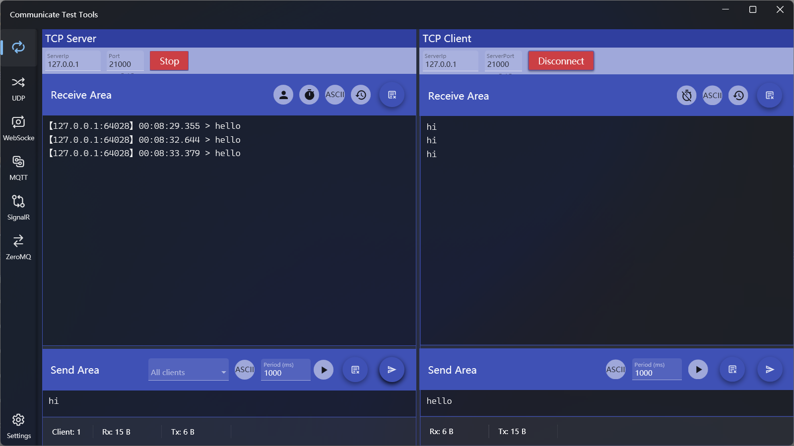
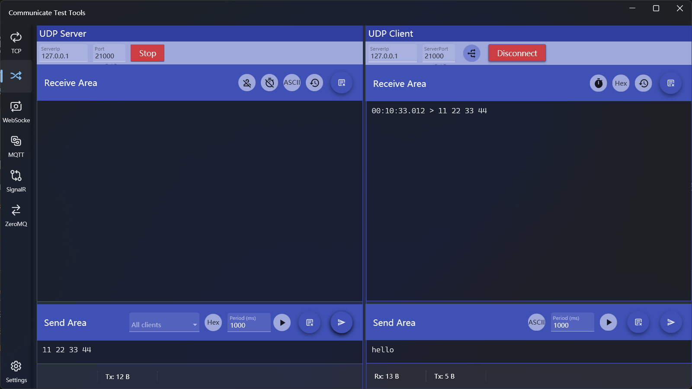
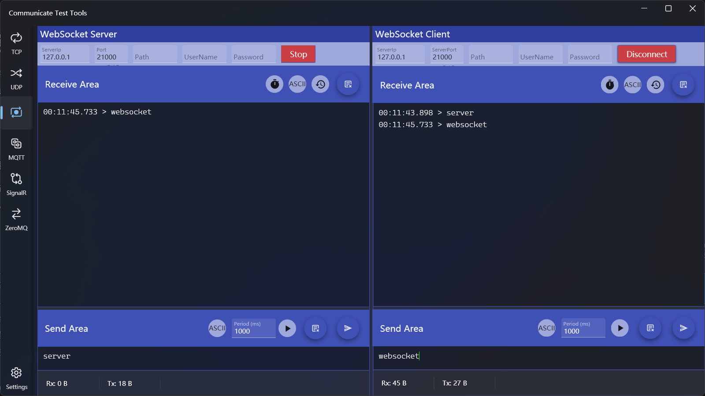
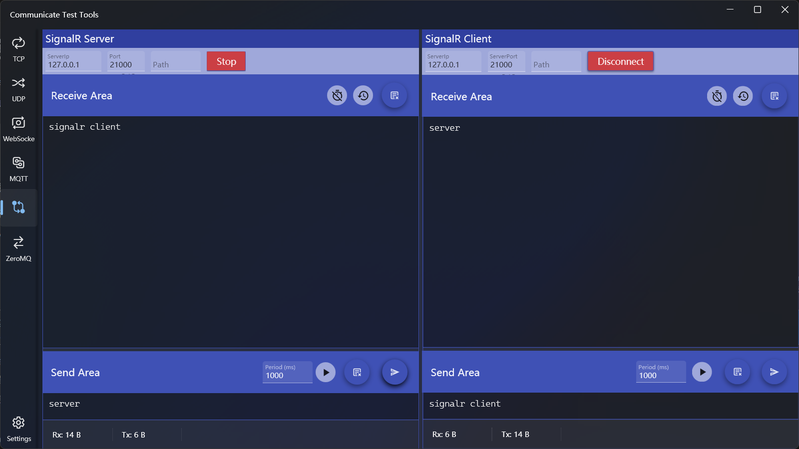

## 介绍
通信测试工具，支持多种通信方式的服务器和客户端，包括TCP、UDP、MQTT、Websocket、SignalR、ZeroMq，另外支持Http响应模拟，可以用于测试http请求或者测试WebApi。

应用中的通信连接界面都分为了左右两部分，左侧为服务端，右侧为客户端。

>! 周期发送会有毫秒精度的误差，使用场景如果需要毫秒级高频率发送时需要注意

## 使用方法
### TCP服务器和客户端

#### 服务器设置
1. 连接配置
  * 输入IP和端口，点击【Start】按钮，成功后按钮会变成【Stop】

2. 接收区选项
  * 接收区域用于显示接收数据记录，可以显示内容包括：数据来源的IP和端口、接收时间、数据内容
  * 区域标题右侧操作功能依次为：
    * IP显示切换开关：用于切换是否显示IP和端口，默认打开显示
    * 时间显示切换开关：用于切换是否显示接收时间，默认打开显示
    * 数据编码模式：可以切换字符串和十六进制模式，默认为字符串
    * 数据显示方式：切换全部显示或者显示最新数据，默认为全部显示
    * 清除接收数据：可以清除接收区数据，清除后如果要查看历史数据可以在日志中查看
3. 发送区选项
  * 发送区域用于发送数据，在编辑区输入内容后点击发送即可，两个发送按钮：左侧为定时周期发送，右侧为单次发送
  * 可以配置的选项包括：
    * 选择发送目标：客户端连接后会显示在客户端列表中，在列表中选择一个可以将数据发送到指定客户端，选择全部可以进行广播
    * 发送数据格式：支持字符串和十六进制，默认为字符串
    * 周期发送：可以在周期文本框输入间隔时间，单位为毫秒，默认1000毫秒，最小间隔为10毫秒，点击周期发送按钮即可按指定间隔周期发送数据。周期发送开始后按钮功能会变成停止，点击即可停止发送。
    * 新版本增加了从文本文件打开发送内容及分行发送开关，开启分行发送，可以将数据按行分割后逐行发送。
  
      > 分行发送开启后如果使用单次发送，由于是同时发送所以没有实际效果；如果使用周期发送，则发送时每行之间会间隔指定的发送周期。
4. 断开连接：点击【Stop】即可断开连接

#### 客户端设置
1. 连接配置
  * 输入IP和端口，点击【Connect】按钮，成功后按钮会变成【Disconnect】

2. 接收区选项
  * 接收区域用于显示接收数据记录，可以显示内容包括：接收时间、数据内容
  * 区域标题右侧操作功能依次为：
    * 时间显示切换开关：用于切换是否显示接收时间，默认打开显示
    * 数据编码模式：可以切换字符串和十六进制模式，默认为字符串
    * 数据显示方式：切换全部显示或者显示最新数据，默认为全部显示
    * 清除接收数据：可以清除接收区数据，清除后如果要查看历史数据可以在日志中查看

3. 发送区选项
  * 发送区除了不能指定目标外其他功能设置和服务器一致
4. 断开连接：点击【Disconnect】即可断开连接

### UDP服务器和客户端

#### 服务器设置
1. 连接配置
  * 和TCP服务器功能设置方法一致
2. 接收区选项
  * 和TCP服务器功能设置方法一致
3. 发送区选项
  * 和TCP服务器功能设置方法一致
  
  > UDP客户端关闭后不会从客户端列表移除，向其发送数据不会被接收

#### 客户端设置
1. 连接配置
  * IP及端口设置方法和服务器一致
  * 设置中增加了一个连接选项，需要在连接之前设置，选项包括
    * 广播方式：只接收服务器发送的广播数据
    * 单独方式：只接收服务器指定给其的数据，不会接收广播数据
2. 接收区选项
  * 和TCP客户端功能设置方法一致

3. 发送区选项
  * 和TCP客户端功能设置方法一致

### Websocket服务器和客户端

#### 服务器设置
1. 连接配置
  * 除了IP和端口，还可以设置Path、用户名和密码
2. 接收区选项
  * 除了不显示IP外，其他和TCP服务器功能设置方法一致
3. 发送区选项
  * 除了不能指定目标外其他和TCP服务器功能设置方法一致

#### 客户端设置
1. 连接配置
  * 除了IP和端口，还可以设置Path、用户名和密码

2. 接收区选项
  * 和TCP客户端功能设置方法一致
3. 发送区选项
  * 和TCP客户端功能设置方法一致

### MQTT服务器和客户端

#### 服务器设置
1. 连接配置
  * 除了IP和端口，还可以设置用户名和密码

2. 接收区选项
  * 增加了主题显示开关，去掉了数据编码模式，其他和TCP服务器功能设置方法一致
  * 接收区下方显示了当前订阅的IP、端口和主题

3. 发送区选项
  * 增加了主题和Qos设置，去掉了数据编码模式，其他和TCP服务器功能设置方法一致

#### 客户端设置
1. 连接配置
  * 除了IP和端口，还可以设置用户名和密码

2. 接收区选项
  * 支持订阅多个主题和Qos，方法为输入主题并选择Qos后点击右侧【+】按钮即可；取消订阅只需点击下方主题列表项右侧的【x】图标删除即可
  * 去掉了数据编码模式，其他和TCP客户端功能设置方法一致

3. 发送区选项
  * 增加了主题和Qos设置，去掉了数据编码模式，其他和TCP客户端功能设置方法一致

### SignalR服务器和客户端

#### 服务器设置
1. 连接配置
  * 除了IP和端口，还可以设置Path

2. 接收区选项
  * 去掉了数据编码模式，其他和Websocket服务器功能设置方法一致

3. 发送区选项
  * 去掉了数据编码模式，其他和Websocket服务器功能设置方法一致

#### 客户端设置
1. 连接配置
  * 除了IP和端口，还可以设置Path

2. 接收区选项
  * 去掉了数据编码模式，其他和Websocket客户端功能设置方法一致

3. 发送区选项
  * 去掉了数据编码模式，其他和Websocket客户端功能设置方法一致

### ZeroMq服务器和客户端

#### 服务器设置
1. 连接配置
  * 和TCP服务器设置方法一致

2. 接收区选项
  * 和SignalR服务器设置方法一致

3. 发送区选项
  * 和SignalR服务器设置方法一致

#### 客户端设置
1. 连接配置
  * 和TCP客户端设置方法一致

2. 接收区选项
  * 和SignalR客户端设置方法一致

3. 发送区选项
  * 和SignalR客户端设置方法一致

### Http服务器和客户端

#### 服务器设置
* 指定端口号和Path，点击【Start】即可启动服务
* 在下方文本框输入模拟响应内容，或者点击右侧【打开文件】按钮从文本文件加载内容
* 点击右侧【清空】按钮可以清空输入的响应内容

#### 客户端设置
* 在上方路径文本框输入请求的完整路径，点击【Request】按钮可以获取响应内容
  * 输入网页地址可以获取网页源码
  * 输入Web Api路径可以获取Api响应
* 点击【Request】左侧的按钮可以直接将路径设置为左侧服务器区域设置的Mock服务路径
* 点击右侧【清空】按钮可以清空响应内容

### 日志查看
应用左侧导航栏最下方菜单为日志查看功能，点击后可以打开如下界面

* 左侧为连接类型列表，点击名称可以查看其对应的日志记录
* 最右侧的三个按钮的作用分别是
  * 复制记录：将日志内容复制到剪贴板
  * 清空记录：清空日志文件内容
  * 重新加载记录：加载最新的日志文件

> 日志只会保留各个连接最后一次连接后的通信数据，在连接启动时会清空以前的日志记录

[商店下载](https://apps.microsoft.com/detail/9MV2NK7FZ4CC)