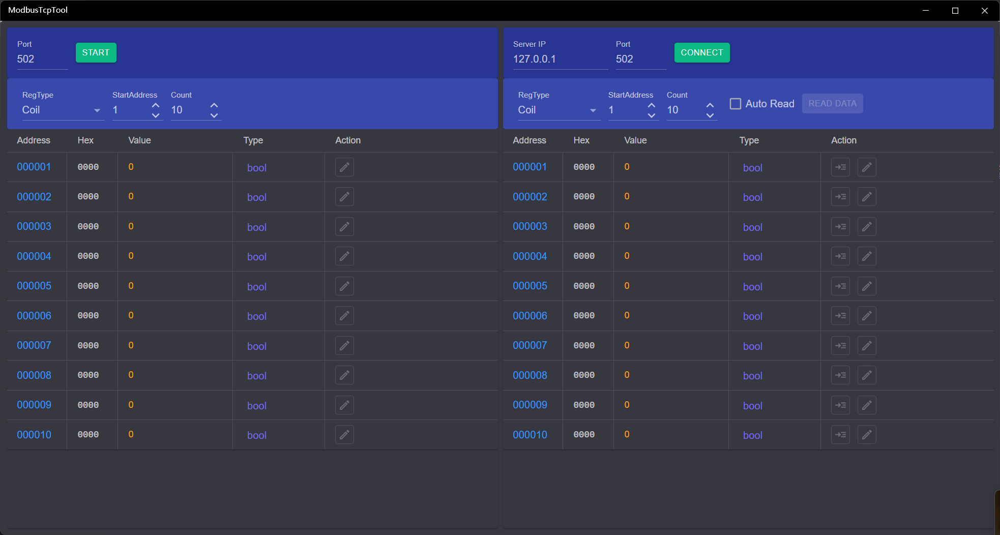

## 介绍

Modbus TCP测试工具，支持服务器和客户端模式，支持4种类型的寄存器，客户端支持定时读取数据，数据支持十进制、十六进制、二进制格式查看。

应用左侧为服务器，即Slave，右侧为客户端，即Master。

### 使用方法

### 服务器操作步骤
1. 启动服务：先设置服务端口号，默认为502，然后点击【Start】启动服务，启动后按钮会变成【Stop】。
2. 设置寄存器：在RegType下拉框选择中选择寄存器类型，在文本框中输入开始地址和数量。
3. 修改值：服务启动后可以点击下方表格中Action列中的编辑图标修改地址中的值。
   * Coil和DiscInput的值为bool类型，编辑时使用复选框修改，选中时值为1，否则为0
   * InputReg和HoldingReg可以修改值类型，使用表格Type列的下拉按钮可以选择类型，可以指定为：short、int、long、float、double和binary
     * binary类型的值实际类型为short，只是在显示时使用二进制，编辑时使用一组复选框修改每个位的值
     * int和float类型的值占用2个地址，修改起始地址的值会同时修改连续的2个地址
     * long和double类型占用4个地址，修改起始地址的值会同时修改连续的4个地址
     * int、long、float、double类型可以通过上方工具栏的LH开关改变字节序
4. 停止服务：点击工具栏的【Stop】按钮即可停止服务。

### 客户端操作步骤
1. 连接服务：输入服务器Ip和端口号，然后点击【Connect】连接服务器，连接成功后按钮会变成【Disconnect】。
2. 设置寄存器：和服务器设置方法一致。
3. 读取值：有手动读取和自动读取两种方式
   * 手动读取：可以点击上方工具栏的【ReadData】按钮一次性读取所有地址的数据，也可以点击表格Action列的第一个图标按钮，获取此行地址的值
   * 自动读取：选中上方工具栏的【AutoRead】复选框，之后会出现读取间隔输入框，可以输入读取间隔（单位为秒，精度为0.1，默认为1秒，最大值为60秒），然后点击【ReadData】按钮即可按指定的读取间隔自动读取所有地址的值。点击【StopRead】即可停止读取。
4. 修改值：RegType为Input和DiscInput时为输入寄存器，不能修改值。另外两种类型修改方法和服务器的修改方法一致。
5. 断开连接：点击工具栏的【Disconnect】按钮即可断开连接。

> 连接第三方服务或客户端时，起始地址可能为0或者1，所以连接后最好先做一次读写测试以确认地址对应关系。
> 
[商店下载](https://apps.microsoft.com/detail/9NZTLN2M1RL8)