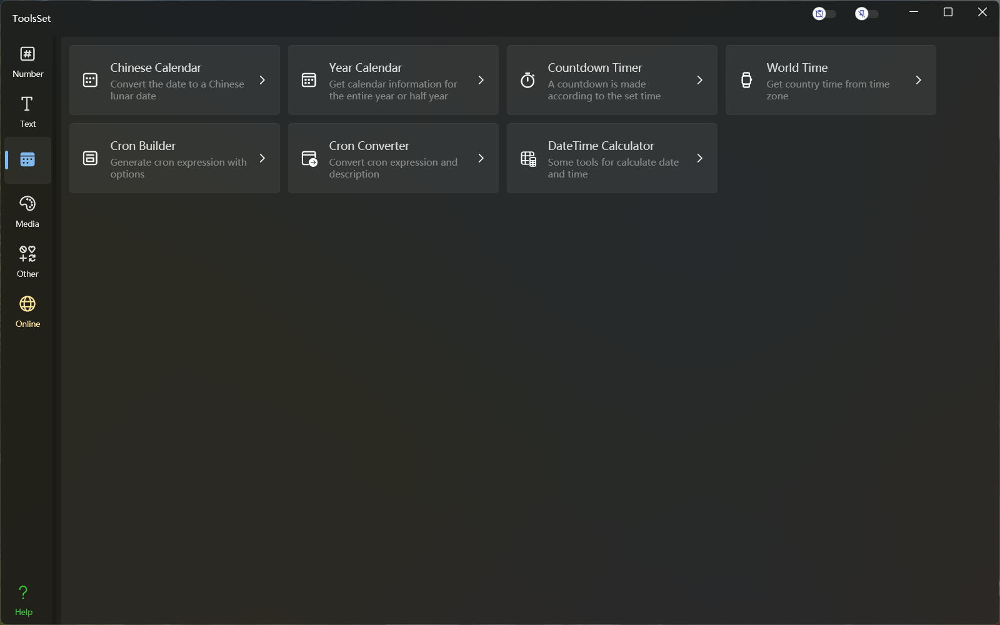

## 介绍

功能包括：Chinese Calendar、Year Calendar、Countdown Timer、World Time、Cron Builder、Cron Converter、DateTime Calculator

## 功能列表

### Chinese Calendar *老黄历*
* 阳历信息
  * 年、月、日、周、季度、星座、闰平年、节日
* 阴历信息
  * 节气、物候、月相、闰月、节日
  * 天干地支、五行纳音、吉凶、宜忌、天神等
  * 各个时辰的时刻、冲煞、旬空、天神、宜忌等

### Year Calendar *年历*
* 全年或半年日历
* 阴历、节气、节日、物候、月相等

### Countdown Timer *倒计时*
* 指定时、分、秒

### World Time *世界时间*
* 可以选择语言
* 选择国家或区域
* 选择时区
* 当前实时时间
* 多时区时间对比

### Cron Builder *Cron表达式生成器*
* 指定年、月、日、时、分、秒参数生成表达式
* 表达式自动转换为描述

### Cron Converter *Cron表达式转换及测试*
* Cron表达式转换24种语言的描述
* 英文描述转换Cron表达式
* 获取指定数量的执行时间

### DateTime Calculator *日期计算器*
* 阳历计算
  * 计算日期推移
  * 计算时间推移
  * 计算日期间隔
  * 计算时间间隔
* 阴历计算
  * 计算阴历日期时间推移
  * 阴历转换为阳历
  * 阴历八字转换为阳历
* 日期转换
  * 本地时间和UTC时间转换
  * 转换儒略日
  * 转换Unix时间戳
  * 转换文件时间
  * 转换 OADate
