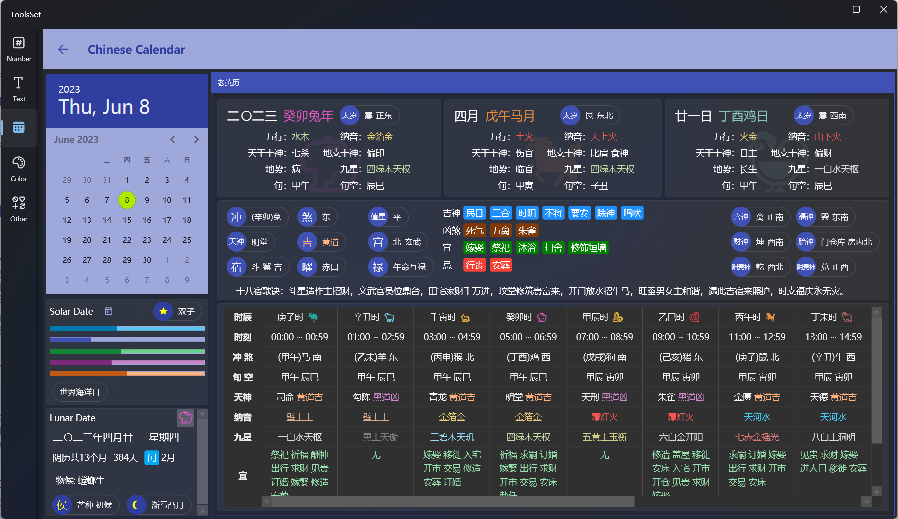

## 介绍

此工具可以查看指定阳历日期的信息及其对应中国农历的各种信息

## 使用方法

1. 选择日期：在左侧上方的日历中点击选择日期
   > 点击日历标题一次可以选择月份，点击左右箭头图标可以按年翻页
   >
   > 点击日历标题两次可以选择年份，点击左右箭头图标可以按十年为单位翻页
   >
   > 点击日历下方的日历图标可以跳转到今天

2. 阳历信息：日历下方的阳历区域展示内容包括
   * 是否闰年
   * 星座
   * 当年第几天
   * 当月第几天
   * 当年第几周
   * 当月第几周
   * 当年第几季度
   * 阳历节日
3. 阴历信息：日历下方的阳历区域展示内容包括
   * 三九/三伏第几天
   * 生肖
   * 阴历日期
   * 阴历月数和天数
   * 阴历闰月信息
   * 物候、节气
   * 侯、月相
4. 老黄历：右侧会显示老黄历内容，从上到下分为三个区域，包含内容分别为：
   1. 阴历年月日信息
      * 阴历中文名称
      * 天干地支
      * 生肖
      * 太岁
      * 五行
      * 纳音
      * 天干十神
      * 地支十神
      * 地势
      * 九星
      * 旬
      * 旬空
   2. 天神和吉凶
      * 冲煞
      * 值星
      * 天神
      * 吉凶
      * 四宫
      * 二十八星宿
      * 六曜
      * 禄
      * 吉神
      * 凶煞
      * 宜忌
      * 吉神方位
      * 胎神方位
      * 二十八星宿歌诀
   3. 时辰信息
      * 时辰名称
      * 时刻
      * 冲煞
      * 旬空
      * 天神
      * 纳音
      * 九星
      * 宜忌
