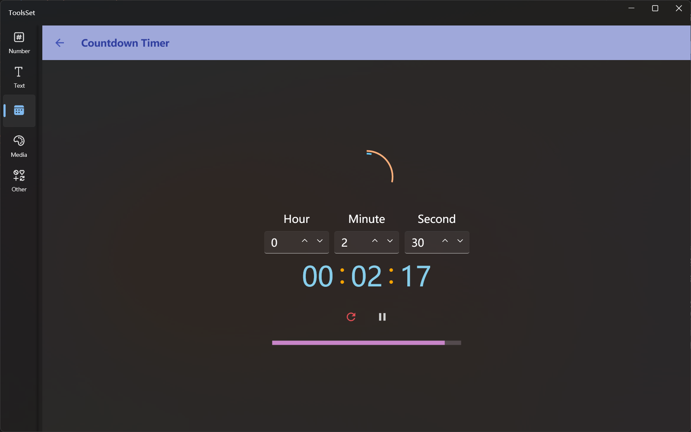

## 介绍

按指定时间进行倒计时

## 使用方法

1. 设置时间：在中间三个文本框输入时分秒
   > 时间可以自动转换，比如输入1分90秒，在启动或重置时可以自动转换为2分30秒
2. 操作：点击时间下方的启动按钮，可以启动计时，启动后按钮会变成重置和暂停
3. 提示信息：计时结束后会发出声音提示
   > 计时过程中上方环形图标指示时、分、秒余量
   > 下方进度条指示总共剩余秒数