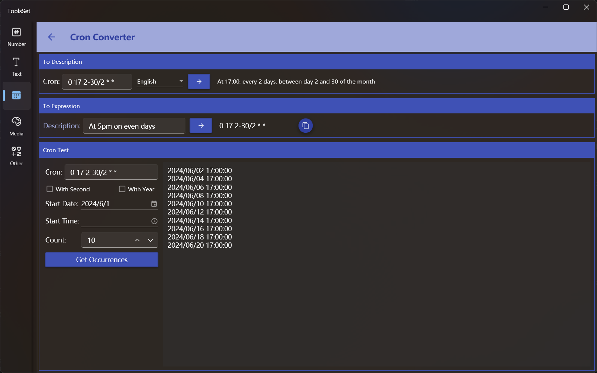

## 介绍

将Cron表达式转换为指定语言的文本描述，或者将英文描述转换为Cron表达式，还可以获取指定数量的执行时间

## 使用方法

* Cron表达式转描述

  在上方文本框输入Cron表达式，从右侧下拉框选择描述语言，点击转换按钮即可将表达式转为相应语言描述

* 描述转Cron表达式

  点击中间区域左侧按钮可以弹出预定义描述选择列表，选择之后描述会显示在右侧文本框中，此时可以对其进行编辑修改，修改完成点击右侧按钮即可转换为Cron表达式

* 生成测试时间

  1. 输入表达式：在Cron Test 上方文本框中输入合法的Cron表达式，超过5个部分时需要选择是否包含秒或年的部分
  2. 选择开始日期和时间：在下方输入或选择开始日期时间，日期为空时为当天，时间为空时0点
  3. 设置数量：在数量文本框输入或用右侧按钮增减数量
  4. 生成时间：点击下方按钮即可在右侧生成指定数量的运行时间列表
