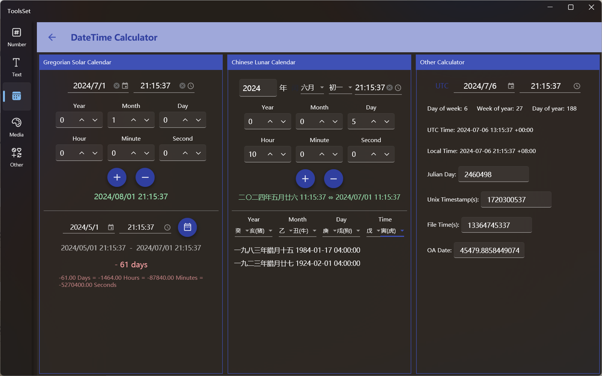

## 介绍

支持阳历日期和时间推移、日期时间间隔计算、阴历日期时间推移、八字转阳历、日期时间转换

## 使用方法

界面分为了三部分，左侧可以进行阳历日期和时间推移和日期时间间隔计算，中间可以进行阴历日期时间推移和八字转阳历，右侧可以进行各种日期时间转换

* 阳历日期和时间推移
  1. 设置开始日期和时间
    
     在上方日期和时间输入框输入或选择起始时间
     > 时间可以为空，为空时只计算日期推移
  2. 设置偏移量
    
     日期时间输入框下方可以设置偏移量，包括年、月、日、时、分、秒
     
  3. 查看结果
     
     点击下方【+】按钮，可以计算开始时间在指定偏移量之后的时间；点击【-】按钮，可以计算开始时间在指定偏移量之前的时间

* 日期时间间隔计算
  1. 起始时间

     起始时间即上方输入设置的时间

  2. 结束时间
     
     在下方文本框输入结束时间

  3. 计算结果

     点击右侧计算按钮即可计算时间间隔，计算结果会显示两个时间相差的年月日时分秒，并用颜色区分时间相差的正负，可以自动转换单位

* 阴历日期时间推移
  1. 设置开始日期和时间

     在上方设置阴历日期和时间，年份设置右侧有闰月开关，可以指定阴历的闰月
     
     时间可以为空，为空时将使用当前时间

  2. 设置偏移量

     日期时间输入框下方可以设置偏移量，包括年、月、日、时、分、秒
     
  3. 查看结果

     点击下方【+】按钮，可以计算开始时间在指定偏移量之后的时间；点击【-】按钮，可以计算开始时间在指定偏移量之前的时间
     > 结果会自动进行阳历转换显示

* 八字转阳历

  在下方的下拉框选择阴历年、月、日和时辰的天干地支，如果是合法的八字组合会自动转换为日期显示，如果对应多个日期会显示为列表。

* 日期时间转换

  右侧上方可以指定待转换时间，可以使用左侧开关选择是本地时间还是UTC时间，下方会显示UTC时间、本地时间、儒略日、Unix时间戳、文件时间和OA Date的转换结果，其中儒略日、Unix时间戳、文件时间和OA Date可以在输入值后反向转换。
