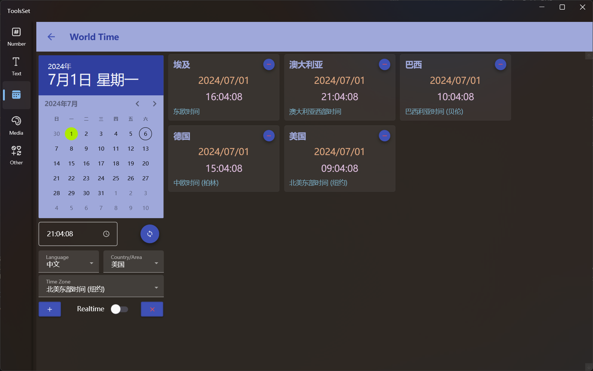

## 介绍

支持多国语言，可以选择国家地区及时区

## 使用方法

* 添加时区：通过左侧几个下拉框选择相应的语言、地区和时区，点击下方【+】按钮将所选地区及时区添加到右侧列表
* 修改时间：通过左侧日历和文本框修改日期和时间，修改之后点击时间文本框右侧按钮将时间同步到右侧所有卡片
  > 可以通过下方实时时间开关来切换当前实时时间显示
* 时间列表操作：点击卡片右上角的按钮可以删除卡片，点击左侧右下角的按钮可以清空右侧列表的所有卡片