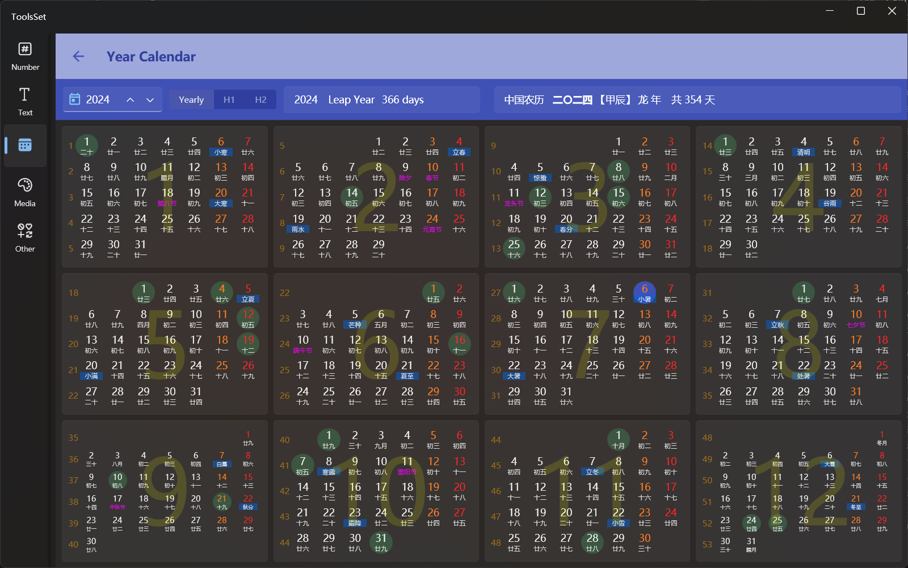

## 介绍

此工具支持以全年或半年为单位查看指定年份日历

## 使用方法

1. 选择年份：在工具栏左侧文本框输入年份，也可以通过上下箭头逐年增加或减少
   > 可以点击左侧图标跳转到当前年份
2. 选择视图：输入框右侧三个按钮可以切换显示方式：
   * Yearly：全年视图
   * H1：上半年视图
   * H2：下半年视图
3. 阳历信息：右侧阳历信息内容展示选择年份、是否闰年、全年天数
4. 农历信息：右侧农历信息内容展示农历中文、农历干支生肖、农历天数
5. 日历视图内容：下方日历视图区域展示内容包括
   * 月份：背景的大数字
   * 阳历日期：表格数字表示
   * 阳历星期：橙色数字为周六，红色数字为周日
   * 周数：左侧黄色数字表示这行是此年第几周
   * 阴历日期：数字下方的中文
   * 节气：数字下方蓝色背景的中文
   * 中国传统节日：数字下方的紫色中文
   * 阳历节日：绿色圆形背景
   * 当前日期：蓝色圆形背景
   > 鼠标悬停到日期上方可以提示信息，内容包括：阳历日期、阴历日期、阴历干支、阳历和阴历的其他节日、物候、月相、三九/三伏天数