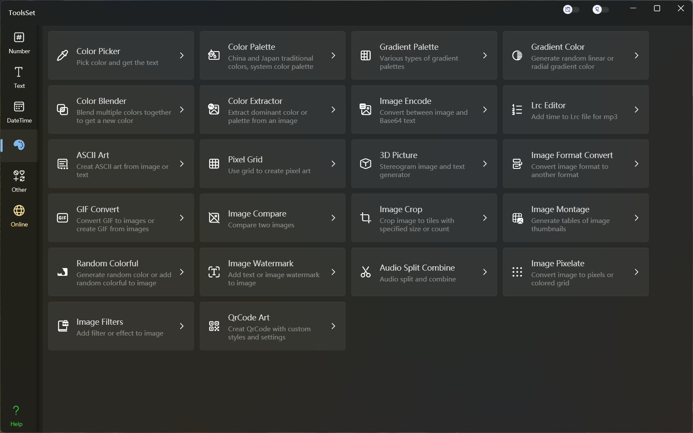

## 介绍

功能包括：Color Picker、Color Palette、HSV Palette、Gradient Color、Color Blender、Color Extractor、Image Encode、Lrc Editor、ASCII Art、Pixel Grid、3D Picture、Image Format Convert、GIF Convert、Image Compare、Image Crop、Image Filters、Image Montage、Random Colorful、Image Watermark、Audio Split Combine、Image Pixelate

## 功能列表

### Color Picker *拾色器*
* 选取颜色
  * 调色板选择
  * 滑动条输入，支持RGB、HSV、HSL方式
  * 16进制RGB输入
  * 随机颜色
* 颜色空间转换
  * RGB
  * HSV
  * HSL
  * CMYK
  * XYZ
  * YIQ
  * YUV
### Color Palette *色盘*
* 中国传统色
* 日本传统色
* Windows系统颜色

### HSV Palette *HSV色板*
* HSV色板
* HSL色板

### Gradient Color *渐变色*
* 生成渐变色
  * 指定颜色数量
  * 指定颜色类型
  * 指定渐变类型
  * 指定角度或中心点
* 复制代码
  * Css代码
  * XAML代码

### Color Blender *颜色混合*
* 选取颜色
  * 调色板选择
  * 选择预定义颜色
  * 输入16进制RGB值
* 混合颜色
  * 两种颜色混合
  * 多种颜色混合

### Color Extractor *颜色提取*
* 添加图片
  * 打开图片文件
  * 粘贴图片
* 提取颜色
  * 提取主题色
  * 提取指定数量的颜色
  * 提取指定位置的颜色

### Image Encode *图片Base64编解码*
* 添加图片
  * 打开图片文件
  * 粘贴图片
* 图片编码为Base64
* 从Base64解码图片

### Lrc Editor *歌词编辑器*
* 打开音频文件
* 展示音频波形
* 点击插入时间

### ASCII Art *ASCII字符画*
* 图片转为字符画
  * 打开图片文件或粘贴图片
  * 指定行列字符数量
  * 指定绘制字符
  * 指定预览字号
* 字体转为字符画
  * 指定字体、字号及文本
  * 指定行列字符数量
  * 指定绘制字符
  * 指定预览字号

### Pixel Grid *像素图绘制*
* 网格设置
  * 指定网格数量
  * 指定网格尺寸
* 绘制设置
  * 指定填充颜色
  * 指定输入文本
  * 连续绘制开关
  * 颜色锁定开关
* 结果输出
  * 导出图片
  * 复制文本

### 3D Picture *3D图片生成*
* 生成3D图片
  * 自定义灰度模型
  * 自定义背景图
  * 保存或复制结果图片
* 生成3D文本
  * 字符模式
    * 指定字体、字号及文本
    * 指定行列字符数量
  * 数组模式
    * 选择类型：自定义或预定义
    * 输入或编辑字符数组
  * 指定绘制字符
  * 指定预览字号
  * 复制结果文本

### Image Format Convert *图片格式转换*
* 源格式支持png、jpg、gif、bmp、tiff、ico
* 目标格式支持png、jpg、gif、bmp、tiff、ico、pdf
* 支持图片缩放

### GIF Convert *GIF转换*
* 图片序列提取
  * 打开GIF文件
  * 提取图片序列
  * 复制单帧图片
  * 导出图片序列
* 生成GIF动画
  * 添加图片序列
  * 持续时间调整
  * GIF动画预览
  * 导出GIF文件

### Image Compare *图片比较*
* 横向比较预览
* 纵向比较预览
* 比较结果查看

### Image Crop *图片分割*
* 指定分割方式
  * 固定数量分割
  * 固定尺寸分割
  * 自定义数量及尺寸
  * 自定义比例分割
* 分割网格预览

### Image Montage *图片拼接*
* 指定背景颜色
* 指定行列数量及间距
* 指定图片块尺寸
* 指定块效果
  * 旋转
  * 边框
  * 相框
  * 阴影

### Random Colorful *随机色彩*
* 指定背景类型
  * 颜色：指定颜色、随机颜色、渐变色
  * 等离子体：等离子体和分形组合
  * 图片
* 指定图案
  * 线：不同角度间距的直线或锯齿
  * 形状：不同形状的网格图案
  * 灰色调：不同比例的点状图案
* 指定特效
  * 无特效
  * 颜色特效
  * 多彩特效
  * 模糊特效

### Image Watermark *图片水印*
* 指定背景图片
* 指定水印参数
  * 水印尺寸
  * 水印位置
  * 叠加类型及平铺
  * 透明度及角度
  * 文本水印：可以指定字体、字号、文本内容、颜色
  * 图片水印：可以指定图片内容和尺寸

### Audio Split Combine *音频分割合并*
* 音频分割
  * 音频频谱显示
  * 分割位置调整
* 音频合并
  * 指定音频序列
  * 指定时间范围

### Image Pixelate *图片像素化*
* 指定图片内容
* 指定背景颜色
* 按尺寸或数量分割
* 指定间距
* 指定图案形状

### Image Filters *图片滤镜*
* 70多种预定义滤镜处理
* 多重滤镜叠加
* 处理结果预览
* 保存处理结果
