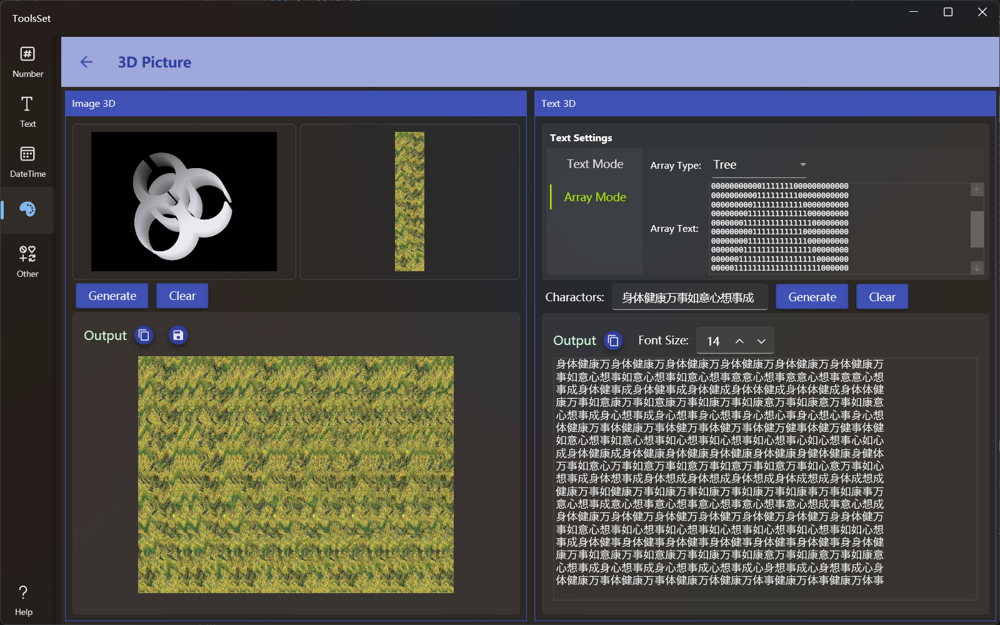

## 介绍

使用灰度图和背景生成3D立体图片，还可以根据文本和数组生成3D的立体文字，这种立体图片和文字需要利用双眼立体视觉即交叉眼才能观看

## 使用方法

左侧为3D立体图片生成区域，右侧为3D文本生成区域

### 生成3D立体图片
* 上方为图片选择区，两个区域都可以通过点击在弹出菜单选择打开或粘贴图片。其中左侧用来选择内容图片，右侧用来选择背景图片
   > 内容图片需要选择代表深度的灰度图，其中越亮的地方越近，越暗的地方越远
   > 背景图不要使用有大面积色块的图象，否则三维影象将效果较差甚至无法辨认
* 图片选择之后点击下方【Generate】按钮即可生成3D图片，点击【Clear】可以清除所有图像

### 生成3D立体文本
* 立体文本有两种生成方式
  1. 使用指定字体的文本
     * 在上方选择文本模式后可以设置字体、字号、行列字符数量和内容文本
  2. 使用数字数组
     * 选择数组模式后，可以在下拉框选择预定义数组或自定义数组，第一项为自定义数组
     * 自定义数组可以在下方文本框输入数字1-9组成的二维数组，其中数字1-9表示距离，数字越大表示距离越近
       > 此数组可以使用本应用的[像素图制作工具](./PixelGrid.md)来生成
  
  > 在中间的文本框可以输入要显示的字符集，字符集中的字符数量不要太少也不要太简单
  >
  > 输出区域的字号设置用于设置输出文本的字号
  >
  > 点击【Generate】按钮可以在下方生成3D文本，点击【Clear】可以清除结果
  