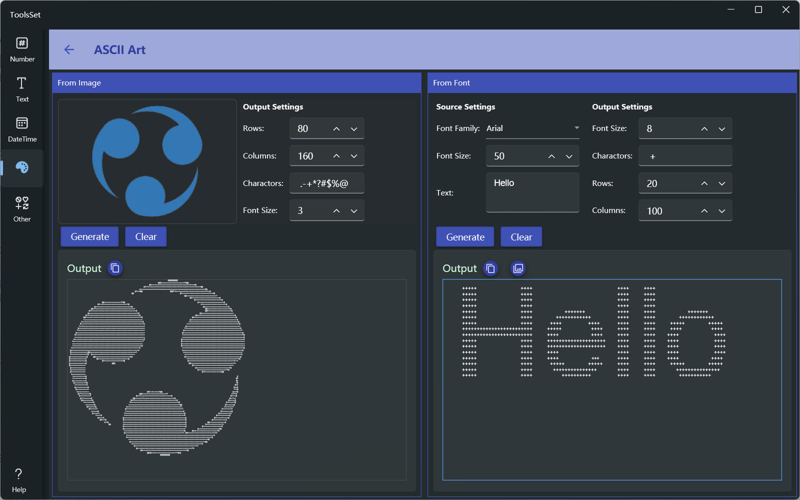

## 介绍

可以将图片或指定字体的文字转换为由指定字符组成的字符画

## 使用方法

左侧为图片转换字符画区域，右侧为文本转换字符画区域

### 图片转字符画

* 添加图片：点击左侧图片区域，在弹出菜单中选择打开图片文件或粘贴图片
* 设置输出参数
  * 行列字符数：用于设置生成字符画的行列字符个数，添加图片时默认为图片高度和宽度的像素数，输出的最大值为图片宽高的2倍
  * 显示字符：用于设置生成的字符画所包含的字符，从左到右的字符对应图片透明度逐渐变小及亮度从深到浅的变化
  * 字号：用于设置在下方显示的预览结果的字号，值范围为1~20
* 点击【Generate】可以按照指定参数在下方显示生成的字符画，点击【Clear】可以清除图片和结果，点击输出右侧的复制图标可以复制生成的文本

### 文本转字符画

* 输入设置：上方左侧用于设置输入文本的参数
  * 字体：设置文本使用的字体
  * 字号：设置文本使用的字号
  * 文字：设置要转换的文字内容
* 输出设置：输出设置参数用法和图片转换区域一致
* 点击【Generate】可以按照指定参数在下方显示生成的字符画，点击【Clear】可以清除结果，输出右侧的两个复制图标分别用于复制生成的文本和黑白图片
  