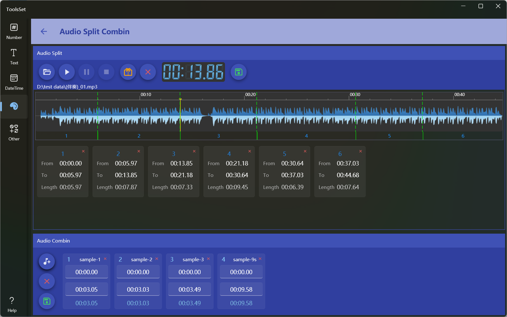

## 介绍
音频分割合并工具，可以将一个音频分割为多个，或者将多个音频合并为一个，音频分割支持频谱可视化操作。

## 使用方法
上方为音频分割区域，下方为音频合并区域

* 音频分割
  * 打开音频文件：点击上方工具栏做的打开文件按钮，可以选择mp3或wav格式的音频文件
  * 音频播放：可以点击工具栏的播放、暂停、停止按钮进行控制
  * 分割音频：在频谱图上点击鼠标设置分割位置，然后点击工具栏的橙色【分割】按钮，即可添加分割标记，在下方列表会显示分割后的音频开始结束时间和时长
  * 调整分割：需要调整时可以点击工具栏红色的【清除】按钮全部清除后重新添加，也可以在下方分割列表中点击右上角的删除按钮删除某个分段
  * 保存结果：点击工具栏右侧【保存】按钮可以将分割结果保存为mp3文件
  > 频谱图上调整位置只支持点击操作，不能进行拖动
  >
  > 如果点击位置和分割位置距离过近（小于1秒），这时进行分割会修改之前的位置 
  >
  > 保存音频时不会保存时长为0的音频
   
* 音频合并
  * 添加音频：点击左侧添加文件按钮打开选择文件对话框，可以从中选择mp3或wav格式的音频文件，支持多选
  * 调整音频：可以点击左侧删除按钮清空右侧列表，或者点击列表项右上角的删除按钮删除一个音频；列表项中的开始结束时间可以修改
  * 保存结果：点击左侧【保存】按钮可以将合并结果保存为wav文件
  > 如果保存失败会提示失败原因，可能为音频文件格式错误、码率不一致、时长设置错误等 