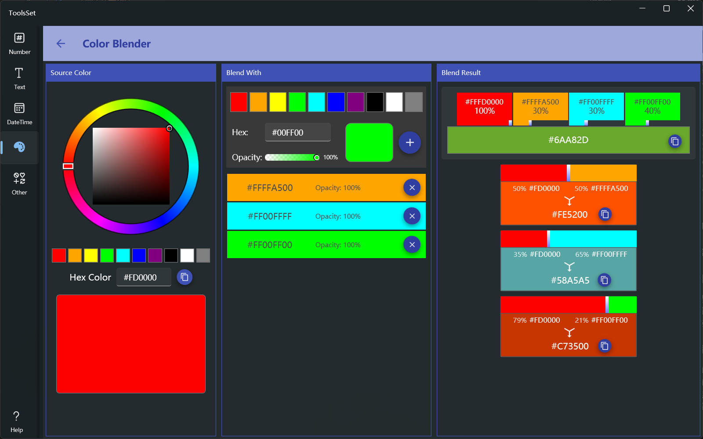

## 介绍

可以选择一种起始颜色，与多种其他颜色进行混合，查看混合后的颜色

## 使用方法

左侧区域用于设置起始颜色，在中间区域选择用来混合的颜色，右侧区域显示混合结果

* 设置起始颜色有三种方式
  1. 使用颜色选择器进行选择
  2. 在预定义的10中颜色中选择
  3. 在文本框中输入16进制颜色代码 
* 设置混合色有两种方式
  1. 在预定义的10中颜色中选择
  2. 在文本框中输入16进制颜色代码
  > 混合色可以使用滑动条设置不透明度
* 混合色设置好之后可以点击右侧【+】按钮添加到下方列表，同时会添加到右侧结果区域，可以通过点击列表项右侧的【x】按钮将其移除
* 配置混合比例
  * 右侧上方显示了所有颜色的混合结果，可以通过每个混合色下方的滑动条调整其比例
  * 右侧下方显示了起始色和每种混合色的混合结果，可以通过两种颜色之间的滑动条调整二者的比例
  * 每个混合结果都可以通过右侧的复制按钮复制混合结果的颜色代码