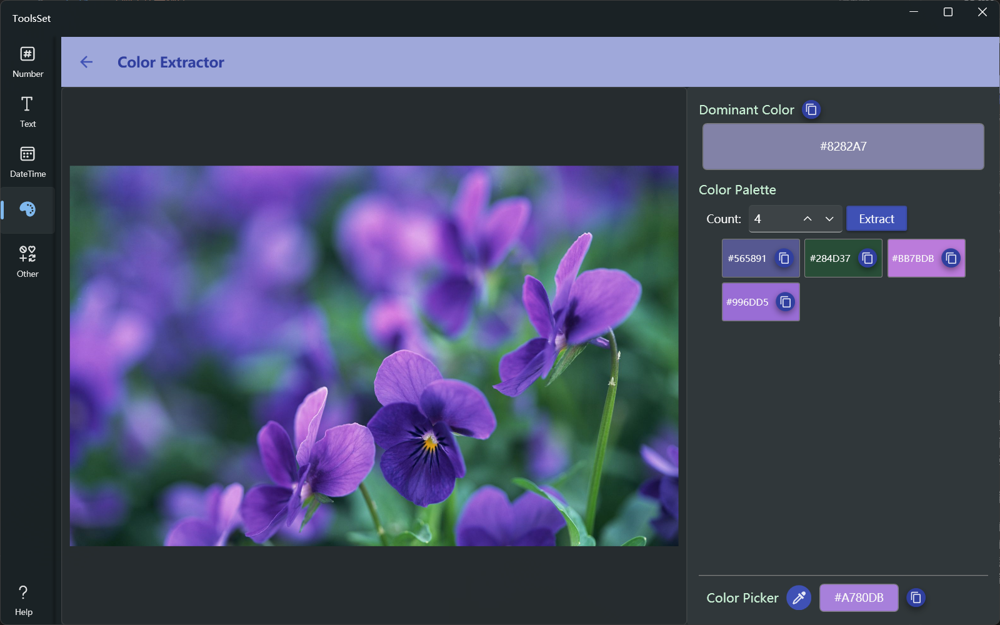

## 介绍

可以从图片中提取主题色和指定数量的颜色，支持使用鼠标取色

## 使用方法

* 点击左侧图片区域，在弹出菜单中选择打开图片文件或粘贴图片
* 图片添加后，右侧上方即可显示图片的主题色，下面默认显示了从图片提取的4种颜色，可以修改数值后点击【Extract】按钮获取指定数量的颜色，最大值为20
* 最下方为取色开关，打开后可以使用鼠标在图片上点击取色，获取的色值会显示在右侧文本框中，可以点击右侧复制按钮复制颜色值
  