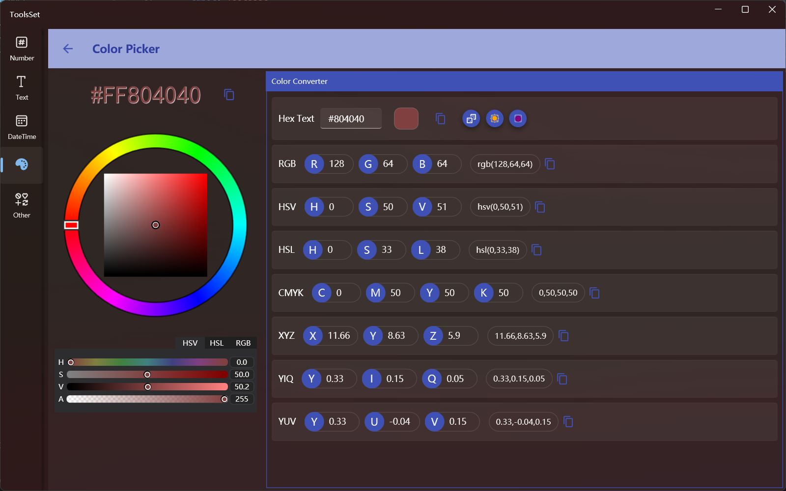

## 介绍

支持颜色选择器、选择随机颜色、颜色空间转换

## 使用方法

* 选择颜色
  
  1. 使用颜色选择器选择颜色
  2. 通过下方滑动条设置颜色，支持HSV、HSL、RGB模式
  3. 通过下方滑动条右侧的文本框设置颜色
  4. 在右侧上方文本框输入十六进制颜色代码

* 随机颜色

  点击文本框右侧三个按钮可以生成随机颜色，分别为
  1. 随机中间颜色
  2. 随机浅色
  3. 随机深色

* 颜色空间转换

选择颜色后会自动进行颜色空间转换，支持的颜色空间有：
  * RGB
  * HSV
  * HSL
  * CMYK
  * XYZ
  * YIQ
  * YUV
  > 点击右侧按钮可以复制各颜色空间的代码文本
