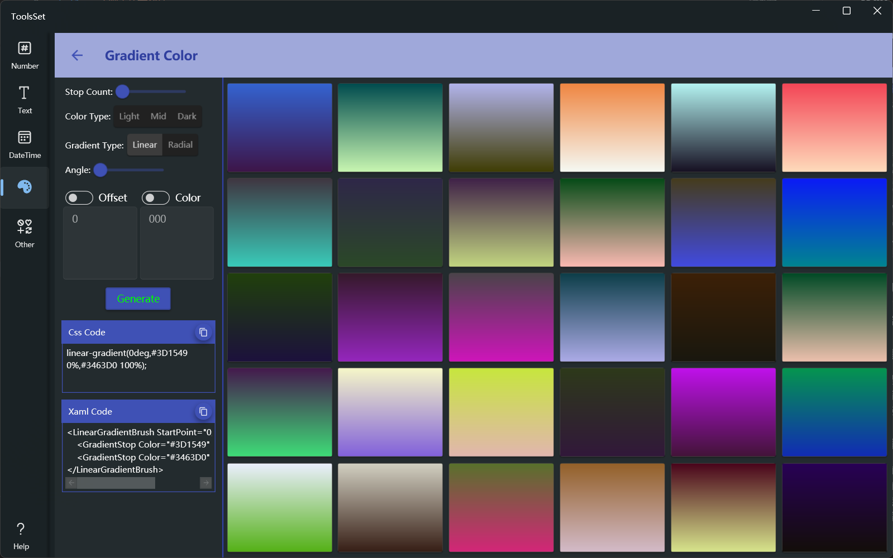
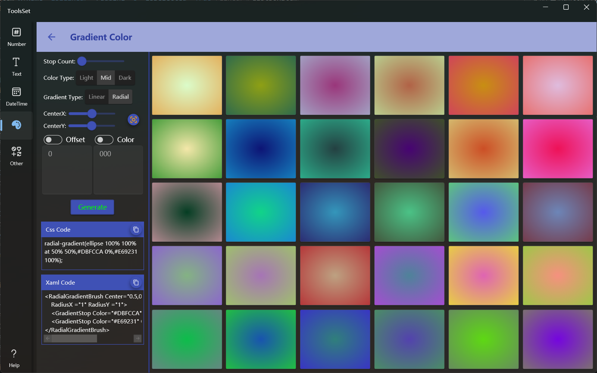

## 介绍

可以按指定参数生成30个随机渐变色，或者一个指定颜色或位置的渐变色，支持线性渐变和径向渐变，线性渐变可以指定角度，径向渐变可以指定中心点，另外可以生成CSS和XAML代码

线性渐变：

径向渐变：

## 使用方法

* 配置参数
  * 颜色节点数量：用于设置生成的渐变有几个颜色节点，数值范围为2~5
    > 开启下方节点位置或颜色设置开关后，此设置将失效，数量由位置和颜色数量确定
  * 颜色类型：指定随机生成颜色时包含的颜色种类，可以选择浅、中、深三种，可以多选，没有选择也会全部包含
  * 渐变类型：可以选择线性渐变或者径向渐变
  * 角度或中心点：线性渐变可以设置角度，范围为0~360；径向渐变可以设置中心点，中心点按水平和垂直方向的比例设置，可以点击中心点设置右侧的按钮重置到中心
  * 节点位置设置：打开【Offset】开关后，可以在下方设置颜色节点位置
    > 位置每行输入一个，范围为0~100，必须为整数
    >
    > 如果没有开启颜色设置，点击【Generate】按钮将会生成一个按此位置、颜色随机的渐变

  * 节点颜色设置：打开【Color】开关后，可以在下方设置节点颜色
    > 颜色每行输入一个，必须为以#开头的16进制颜色值
    >
    > 如果没有开启位置设置，点击【Generate】按钮将会生成一个按此颜色、位置平均分配的渐变
  
  * 如果位置设置和颜色设置同时开启，按照输入内容的数量分为三种情况
    * 位置数量和颜色数量相等：点击【Generate】按钮将会生成一个颜色和位置相对应的渐变
    * 位置数量少于颜色数量：生成渐变时没有位置对应的颜色将会从最后一个位置开始平均分配
    * 位置数量多于颜色数量：生成渐变时没有颜色对应的位置将会使用随机颜色，类型由上面的颜色类型指定

  * 左侧生成按钮下方分别是CSS和XAML代码区，显示一个颜色时，内容就是那个颜色的代码，否则为列表中鼠标点击的颜色的代码，可以通过点击右侧复制按钮复制代码